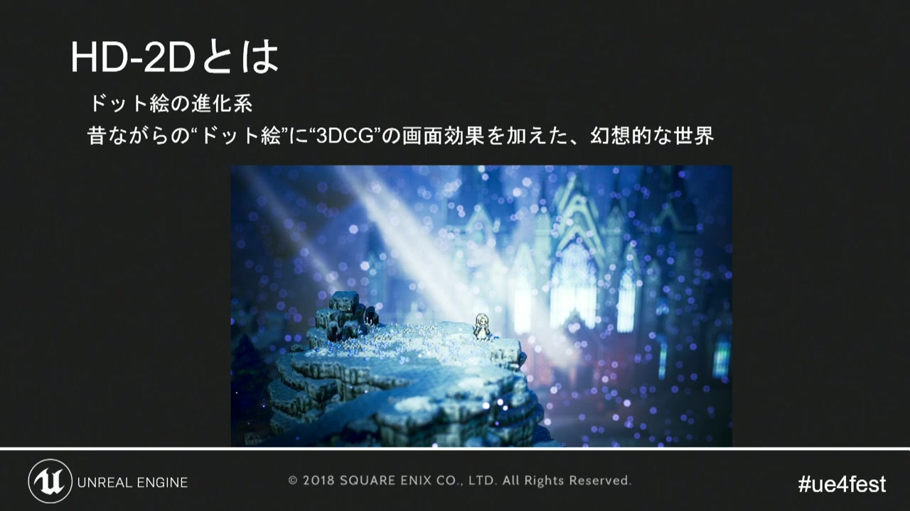
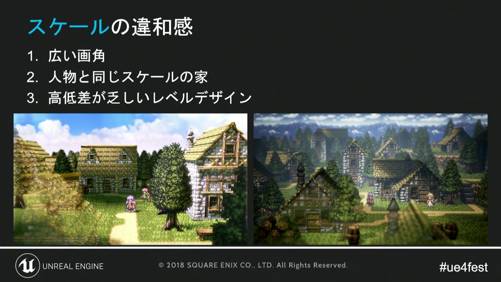
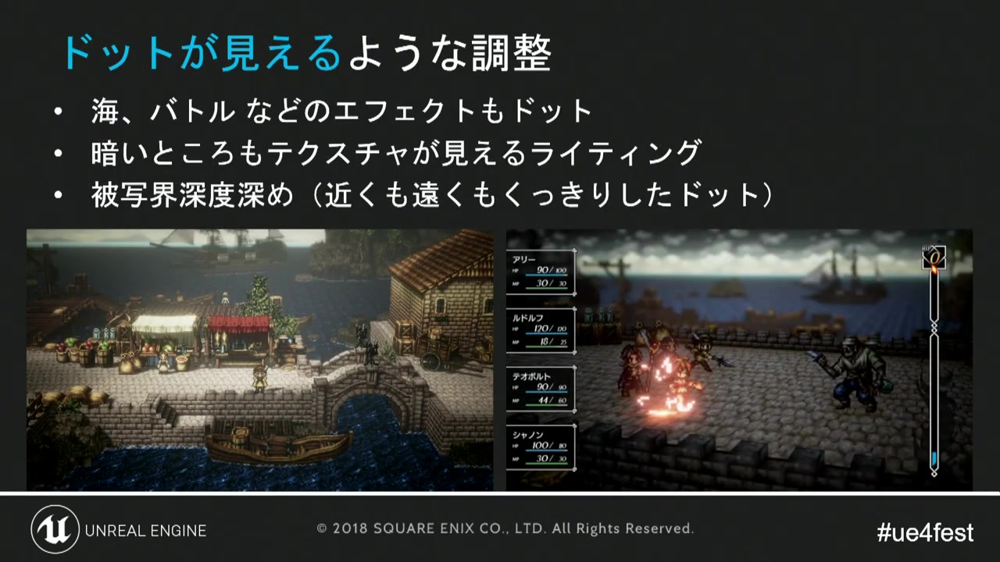
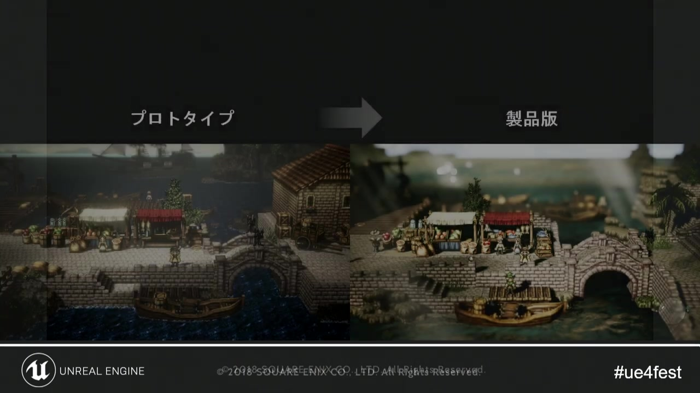
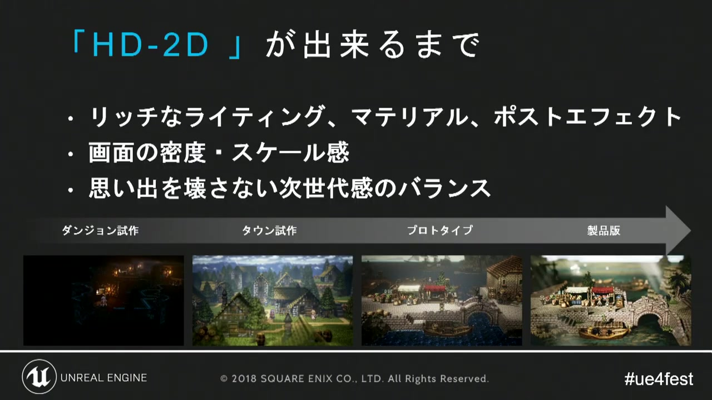

# 01. HD-2Dの画面設計

[目次へ](../README.md) ｜ [次章：キャラクターとマテリアル](02_character_and_material.md)

**動画範囲:** おおよそ 03:00–12:20

## 先に結論

HD-2Dの成立条件は「2D素材を3Dに置くこと」ではなく、画面内にある複数の縮尺と情報密度を、ひとつの絵として調停することです。ピクセルキャラクター、建築物、地形、光、被写界深度は、別々に正しくても組み合わせた瞬間に違和感を生みます。

*図1: ドット絵に3DCGの画面効果を加えた「幻想的な世界」としての定義。*

## スケールの違和感を設計課題として扱う

講演では初期の問題として、広い画角、人間と同じスケールに見える家、高低差が乏しいレベルデザインが挙げられています。これは単純なモデルサイズの誤りではありません。画面上の人物の高さ、カメラの画角、建物の窓や扉の密度、地表のテクセル密度が、互いに異なる世界の縮尺を主張している状態です。

*図2: 初期画面で認識された三つのスケール問題。*

Godotでは次の順に基準を固定します。

1. 出力解像度とアスペクト比を決める。
2. 基準キャラクターを`AnimatedSprite3D`で配置し、画面上の高さを決める。
3. `Camera3D`の投影方式、FOV、角度、距離を固定する。
4. 扉、階段、手すりなど、人が触れる形状から背景の縮尺を決める。
5. 前景・中景・遠景の情報密度を確認してから装飾を増やす。

透視投影は奥行きとドラマ性を作りやすい一方、距離によってピクセルの見かけサイズが変わります。正投影はピクセルサイズを保ちやすい一方、奥行きの誇張が弱くなります。HD-2Dでは透視投影を使いながらカメラ移動を制限する設計も有効です。どちらを選ぶ場合も、カメラを調整し続けながら背景を量産するのは避け、基準ショットをアセット仕様として扱います。

## 「ドット感」は解像度だけではない

講演では、滝、バトルエフェクト、暗所のライティング、被写界深度による遠景の見え方まで、ドットとして認識できるように調整しています。

*図3: ピクセルの輪郭を保つため、素材・光・ボケを横断して調整している。*

Godotで守るべき点は次のとおりです。

- ピクセル素材のImportでは、原則としてフィルターを無効にする。
- Sprite sheetは余白を設け、アトラス内の隣接フレームがにじまないようにする。
- カメラ移動とSprite3Dの画面上の移動が細かすぎる場合は、移動量やアニメーションを意図的に量子化する。
- DOFでキャラクターの顔や輪郭を半端にぼかさない。焦点面と遷移幅を基準ショットで決める。
- 半透明の軟らかいエフェクトだけに頼らず、中心部に明確なピクセル形状を残す。

ピクセルアートを3D空間で表示すると、常に整数倍で描く純2Dのピクセルパーフェクト表示は維持しにくくなります。そこで「全フレームで完全な整数倍」を目指すのではなく、静止時の輪郭、移動時のちらつき、遠景への遷移という三つの品質を個別に評価します。

## 試作から製品版へ

*図4: 同じ構図を保ちつつ、素材、光、空気感、画面密度が段階的に統合されている。*

講演の比較から分かるのは、完成度の向上が単一の高価な機能によるものではないことです。Base Color、ライティング、ポストプロセス、地形の凹凸、前景遮蔽を積み重ねています。

*図5: ダンジョン試作、町試作、プロトタイプ、製品版という検証の流れ。*

Godotでの試作も、次の四段階に分けると判断しやすくなります。

| 段階 | 作るもの | 合格条件 |
|---|---|---|
| 構図試作 | 箱、基準キャラ、Camera3D | 人物と建築の縮尺が破綻しない |
| 光試作 | DirectionalLight3D、Environment | キャラの輪郭と移動可能領域が読める |
| 素材試作 | 代表的な壁、地面、SpriteFrames | テクセル密度とピクセル密度が競合しない |
| 統合試作 | 前景、DOF、Glow、エフェクト | 静止画だけでなく移動中も読める |

## 基準ショットの作り方

町、ダンジョン、フィールド、戦闘について、それぞれ最低1枚の基準ショットを用意します。画像だけでなく、次の値を一緒に記録します。

- 出力解像度
- Camera3DのTransform、FOVまたはSize
- キャラクターの画面上の高さ（px）
- Environmentリソース名
- 主光源の角度、色、Energy
- DOFの焦点距離と遷移範囲
- Glow、露出、色調整のプロファイル

これらはスクリーンショット比較の再現条件です。見た目の議論を「もう少しHD-2Dらしく」から「キャラクターが基準より12px小さく、前景ボケが輪郭へ侵入している」へ変えられます。

## レビュー用チェックリスト

- [ ] キャラクターの顔、武器、進行方向が一目で読める
- [ ] 扉、階段、窓の縮尺がキャラクターと一致する
- [ ] 前景・中景・遠景の三層が、色だけでなく奥行きでも分離している
- [ ] DOFを無効にしても構図とライティングが成立している
- [ ] カメラ移動中にSprite3Dのピクセルが過度にちらつかない
- [ ] 暗所でも輪郭のコントラストが失われない
- [ ] UIを重ねた状態で主役と操作対象が埋もれない

## 次章への接続

画面の縮尺を決めたら、次はキャラクターのSpriteFrames、アニメーションのコマ数、共通マテリアルを量産可能な形へ落とし込みます。

---

[目次へ](../README.md) ｜ **次のページ:** [02. キャラクターとマテリアル](02_character_and_material.md)
