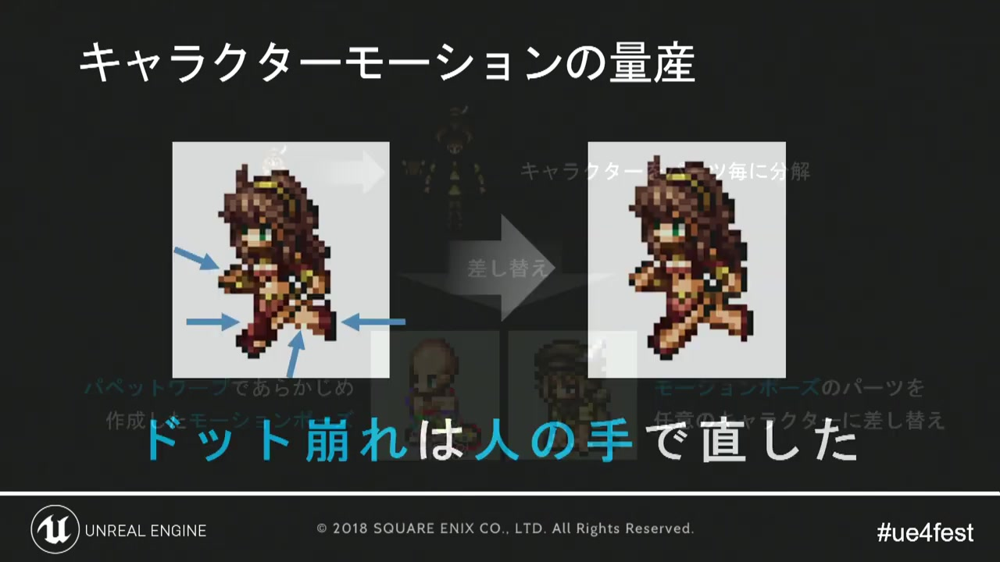
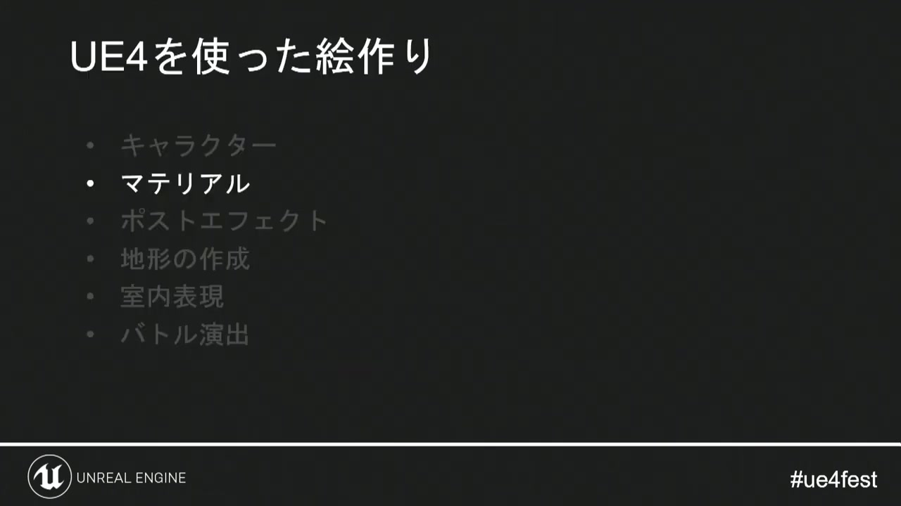

# 02. キャラクターとマテリアル

[前章：HD-2Dの画面設計](01_hd2d_design.md) ｜ [目次へ](../README.md) ｜ [次章：マテリアル／シェーダー表現](03_shader_techniques.md)

**動画範囲:** おおよそ 12:20–15:20

## モーションは「滑らかさ」ではなく画風に合わせる

講演では、キャラクターにUE4のPaperFlipbookを使い、Photoshopのパペットワープでモーションを量産したことが説明されています。しかしメモリと開発効率の都合から、カスタムムービープログラムによる自動生成ではなく、最終的に人の手で6コマ程度へ直しています。



*図1: 連続的な変形を、そのまま使わずピクセルアニメーションのコマへ再編集する。*

これは重要な制作上のヒントです。ピクセルキャラクターでは中間フレームが多いほど良いとは限りません。補間で輪郭が毎フレーム変形すると、形の読みやすさが落ち、柔らかすぎる動きになります。

Godotでは`AnimatedSprite3D`と`SpriteFrames`を基本にします。

- 歩行や待機は、ポーズの差が読める最少コマ数から始める。
- `SpriteFrames`のFPSを上げる前に、各コマのシルエットを確認する。
- キャラクター本体の移動とスプライトアニメーションを分離する。
- 攻撃の溜め、命中、戻りは等間隔にせず、フレームの保持時間で重さを作る。
- 方向差分は、左右反転で済むものと専用作画が必要なものを先に分類する。

## Godotでの基本ノード構成

```text
CharacterBody3D
├── CollisionShape3D
├── VisualPivot
│   ├── AnimatedSprite3D
│   └── ShadowDecal / ShadowSprite
├── InteractionArea
└── AnimationPlayer
```

`AnimatedSprite3D`は3D空間内の2Dアニメーションを扱えます。`VisualPivot`を分けると、当たり判定と足元を動かさずに、被弾の揺れ、ジャンプ風の上下動、ノックバック時の傾きを視覚部分だけへ適用できます。

Billboardは常にカメラを向かせるのに便利ですが、どの方向からも同じ絵が見えるため、地形の傾斜やカメラ回転との整合性を確認してください。カメラ角度が固定なら、Billboard任せにせず、基準角度へ固定したSprite3Dのほうが影や足元を制御しやすい場合があります。

## ピクセル素材のImport方針

| 項目 | 推奨方針 | 理由 |
|---|---|---|
| Filter | 基本はNearest | 輪郭のぼけを防ぐ |
| Mipmaps | カメラ距離が変わる場合に比較検証 | OFFは遠景でちらつき、ONは輪郭が軟化する |
| Atlas余白 | 1–2px以上の押し出しを検討 | 隣接セルの色にじみを防ぐ |
| 圧縮 | アルファ輪郭と色段差を実機確認 | ブロックノイズがピクセル形状に直結する |
| 色空間 | 色テクスチャはsRGB、データマスクは線形 | 頂点マスクや制御値の変形を防ぐ |

Import設定は画像ごとにばらばらにせず、キャラクター、VFX、環境ドット素材ごとのプリセットとして運用します。

## 共通マテリアルで量産する



*図2: キャラクター、マテリアル、ポストプロセス、地形、室内、バトルを一連の画づくりとして扱う。*

講演では、多くの3Dアセットをほぼ一つのマスターマテリアルから作成し、機能をスイッチして使い分けています。Godotでは一つのspatial shaderを複数の`ShaderMaterial`から共有する設計に相当します。

ただし、すべてを一つの巨大シェーダーへ詰め込むと、分岐、uniform、検証組み合わせが増えます。次の三層に分けると保守しやすくなります。

1. **共通shader:** World UV、頂点マスク、アルファカット、発光など、計算の骨格。
2. **用途別ShaderMaterial:** 地面、建築、植生、発光小物などの標準値。
3. **個体差:** `instance uniform`と`set_instance_shader_parameter()`で色、位相、強度を変更。

共有`ShaderMaterial`の通常uniformを書き換えると、そのMaterialを共有する全オブジェクトへ影響します。個体ごとの風の位相や発光量は`instance uniform`へ分離してください。反対に、個体差のためだけにMaterialを複製し続けると、リソース数と状態変更が増えます。

## 見た目のデータをResourceにする

キャラクター本体のロジックから、見た目の組み合わせを切り離します。

```gdscript
class_name CharacterVisualSet
extends Resource

@export var sprite_frames: SpriteFrames
@export var material: ShaderMaterial
@export var visual_scale: float = 1.0
@export var foot_offset: Vector3 = Vector3.ZERO
@export var shadow_size: Vector2 = Vector2.ONE
```

このResourceをキャラクター／ジョブ単位に分けると、ロジックシーンを複製せずに見た目を差し替えられます。一方、Resourceが全キャラクターの全ジョブを直接参照すると、ロード時に大量のテクスチャが常駐します。Resourceの分割単位は、後半の[スプライトアニメーションのメモリ](08_sprite_memory.md)で扱うロード単位と一致させます。

## 制作フロー

1. 代表キャラクター1体で、基準カメラに対するpx/m相当の見かけサイズを決める。
2. 待機・歩行・攻撃の最少コマを作り、輪郭をレビューする。
3. Sprite sheetへまとめ、Import設定と余白を固定する。
4. 共通ShaderMaterialで暗所、逆光、発光の見え方を確認する。
5. 方向差分、ジョブ差分、装備差分をResourceのロード境界に分ける。
6. 量産前にVRAMとロード時間を測り、1キャラクター当たりの予算を決める。

## 公式資料

- [AnimatedSprite3D](https://docs.godotengine.org/en/stable/classes/class_animatedsprite3d.html)
- [SpriteFrames](https://docs.godotengine.org/en/stable/classes/class_spriteframes.html)
- [2D sprite animation](https://docs.godotengine.org/en/latest/tutorials/2d/2d_sprite_animation.html)
- [Import process](https://docs.godotengine.org/en/stable/tutorials/assets_pipeline/import_process.html)

---

[前のページ：01. HD-2Dの画面設計](01_hd2d_design.md) ｜ [目次へ](../README.md) ｜ **次のページ:** [03. マテリアル／シェーダー表現](03_shader_techniques.md)
