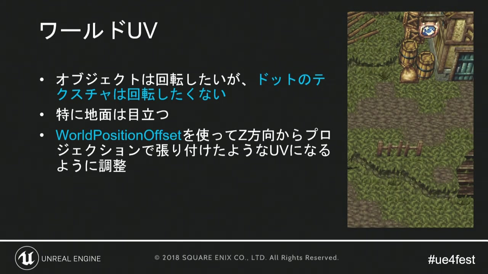
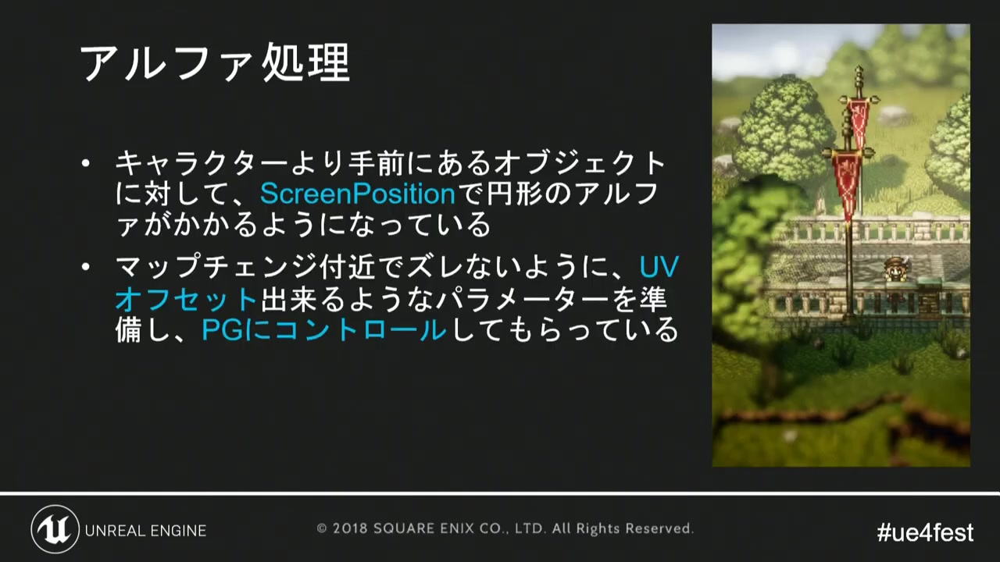
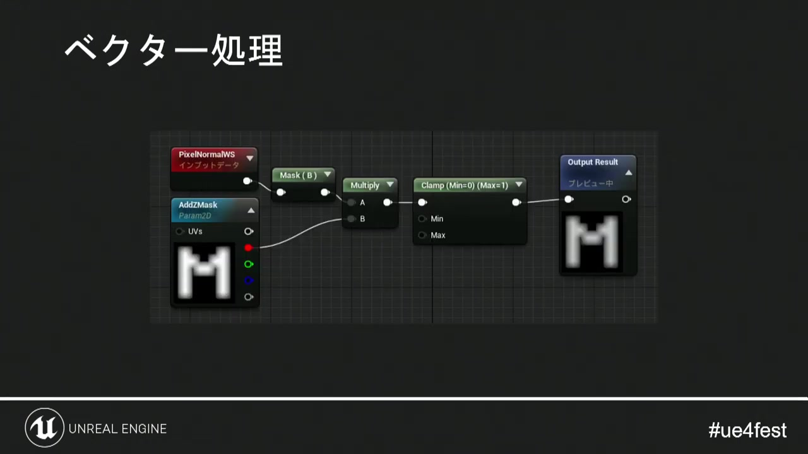
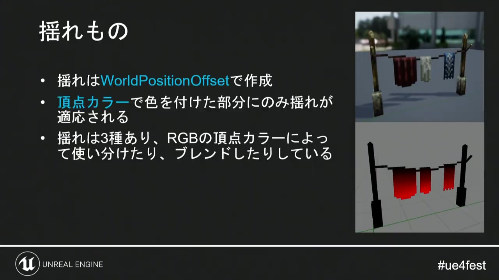
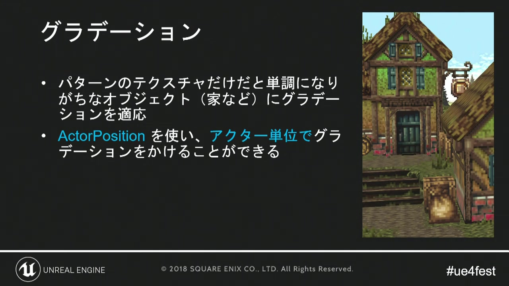
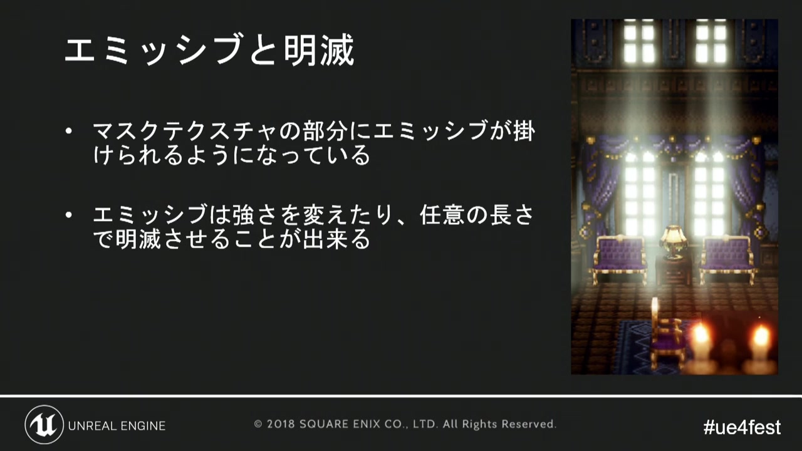

# 03. マテリアル／シェーダー表現

[前章：キャラクターとマテリアル](02_character_and_material.md) ｜ [目次へ](../README.md) ｜ [次章：ポストプロセス](04_post_processing.md)

**動画範囲:** おおよそ 15:20–21:30

## この章の目的

講演のマテリアル技法は、豪華な物理表現を追加するというより、少ないテクスチャと単純な形状から、画面に必要な情報を引き出すために使われています。Godotでも、次の六つを共通shaderの選択可能な機能として設計すると再利用しやすくなります。

1. World UVによる投影
2. アルファカットと位置補正
3. 法線方向を使った上面マスク
4. 頂点カラーを使った揺れ
5. オブジェクト単位のグラデーション
6. マスクによる発光

## 1. World UV — 回転しても模様の方向を保つ



*図1: オブジェクトを回しても、地面のドットテクスチャは同じ方向を向く。*

通常のUVはMeshと一緒に回転します。地表の細かなドットや汚れの方向を世界全体で揃えたい場合は、ワールド座標のXZをUVとして使います。

Godotのspatial shaderでは、`render_mode world_vertex_coords`を使うと`vertex()`内の`VERTEX`をワールド座標として扱えます。fragmentへ渡すには`varying`へ保存します。

```glsl
shader_type spatial;
render_mode world_vertex_coords;

uniform sampler2D world_pattern : source_color, repeat_enable, filter_nearest;
uniform float world_uv_scale = 0.5;

varying vec3 world_position;

void vertex() {
    world_position = VERTEX;
}

void fragment() {
    vec2 world_uv = world_position.xz * world_uv_scale;
    vec3 pattern = texture(world_pattern, world_uv).rgb;
    ALBEDO = pattern;
}
```

World UVは便利ですが、垂直面へXZ投影すると模様が引き伸ばされます。地面専用にするか、ワールド法線から投影軸を選ぶトライプラナー投影を使います。ピクセル模様ではトライプラナーのブレンドが輪郭を軟化させることがあるため、軸の切替を硬めにする比較も必要です。

## 2. アルファ処理 — キャラクターと遮蔽物を両立する



*図2: Screen PositionやUVオフセットを利用し、遮蔽物のアルファを局所制御する考え方。*

講演では、キャラクターより手前にあるオブジェクトに対して、画面位置から円形のアルファ抜きを行っています。Godotでは二種類の実装を使い分けます。

### ディザ抜き／アルファカット

遮蔽物の一部を完全に描くか捨てる方式です。透明ソート問題が少なく、ピクセル表現とも相性が良好です。

```glsl
shader_type spatial;
render_mode depth_prepass_alpha;

uniform sampler2D albedo_texture : source_color, filter_nearest;
uniform float alpha_cutoff : hint_range(0.0, 1.0) = 0.5;

void fragment() {
    vec4 base = texture(albedo_texture, UV);
    ALBEDO = base.rgb;
    ALPHA = base.a;
    ALPHA_SCISSOR_THRESHOLD = alpha_cutoff;
}
```

### 画面空間の遮蔽ホール

`SCREEN_UV`とプレイヤーの画面位置を比較し、一定範囲をディザで抜きます。複数の遮蔽物へ同じ位置を渡す場合、毎オブジェクトのMaterialを複製せず、Global Shader Parameter（`RenderingServer.global_shader_parameter_set()`）か`instance uniform`を使います。完全な半透明にすると、影、深度、ソートの問題が増えるため、まずアルファカットのドットパターンを検討してください。

## 3. ベクター処理 — 上面だけを選ぶ



*図3: 上方向を向く面だけに別テクスチャや効果を適用する。*

雪、苔、明るい縁などを上面だけへ乗せる場合、ワールド法線と上方向ベクトルの内積をマスクにします。fragment内の`NORMAL`はビュー空間なので、ワールド空間へ戻して比較します。

```glsl
vec3 world_normal = normalize(mat3(INV_VIEW_MATRIX) * NORMAL);
float top_mask = smoothstep(0.45, 0.75, world_normal.y);
ALBEDO = mix(side_color, top_color, top_mask);
```

`smoothstep`の二値を近づけると境界が硬くなり、ピクセルアート寄りになります。法線マップを使うと細かな凹凸でマスクが揺れるため、必要なら頂点法線由来の値を`varying`で渡し、ベース形状の上面だけを判定します。

## 4. 頂点カラーによる揺れ



*図4: World Position Offsetと頂点カラーで、揺れる範囲と強度を指定している。*

旗、草、暖簾は、頂点カラーを「どれだけ動かすか」のマスクとして利用できます。根元を0、先端を1に塗り、RGBを複数の風成分へ割り当てます。

```glsl
shader_type spatial;
render_mode world_vertex_coords;

uniform vec3 wind_direction = vec3(1.0, 0.0, 0.0);
uniform float wind_amplitude = 0.05;
uniform float wind_speed = 1.2;
uniform float wind_frequency = 0.8;
instance uniform float wind_phase = 0.0;

void vertex() {
    float sway_mask = COLOR.r;
    float wave = sin(
        TIME * wind_speed
        + VERTEX.x * wind_frequency
        + VERTEX.z * wind_frequency
        + wind_phase
    );
    VERTEX += normalize(wind_direction) * wave * wind_amplitude * sway_mask;
}
```

すべての個体が同時に揺れると人工的に見えます。`wind_phase`を`instance uniform`にして、`GeometryInstance3D.set_instance_shader_parameter()`から個体差を渡します。影を落とすMeshでは、影パスでも同じ頂点変形が使われることを確認します。

## 5. アクター単位のグラデーション



*図5: Actor Positionを使い、家全体へ一貫した明暗や色変化を付ける。*

UVだけを使うと、壁・屋根・装飾など別Meshの境界でグラデーションがずれます。オブジェクトの基準位置とワールド位置との差を使えば、複数Meshをひとまとまりとして色付けできます。

Godotでは、親`Node3D`の基準高さを`instance uniform`で渡し、`world_position.y - gradient_origin_y`を0–1へ正規化します。地面との接地側を暗くする、屋根側を暖色へ寄せる、画面奥を彩度低下させる、といった用途に使えます。

## 6. エミッシブと明滅



*図6: マスクテクスチャで発光箇所を限定し、強さや長さを調整する。*

窓、ランタン、魔法、看板は、色テクスチャの一部または専用マスクを`EMISSION`へ入れます。

```glsl
uniform sampler2D emission_mask : repeat_disable, filter_nearest;
uniform vec4 emission_tint : source_color = vec4(1.0, 0.65, 0.25, 1.0);
uniform float emission_energy = 2.0;

void fragment() {
    float mask = texture(emission_mask, UV).r;
    float flicker = 0.92 + 0.08 * sin(TIME * 7.0);
    EMISSION = emission_tint.rgb * emission_energy * mask * flicker;
}
```

発光Meshが明るいだけでは、周囲の壁や地面は照らされません。必要に応じて、小さな`OmniLight3D`、発光に同期するLightのEnergy、Glowを組み合わせます。多数の窓へ個別Lightを置くと負荷が増えるため、背景はEmissionだけ、主役付近だけLightを追加する階層化が有効です。

## 共通shaderへ統合する際の設計

| 機能 | 入力 | 個体差に向く値 | 主な失敗 |
|---|---|---|---|
| World UV | ワールド位置 | UVスケール、位相 | 垂直面の伸び、遠景のモアレ |
| アルファ | Texture alpha、Screen UV | 抜き位置、半径 | 透明ソート、影の欠落 |
| 上面マスク | ワールド法線 | 閾値 | 法線マップで境界が揺れる |
| 揺れ | 頂点カラー、TIME | 位相、振幅 | 全個体の同期、根元の移動 |
| グラデーション | ワールド位置 | 原点、高さ、色 | オブジェクト間の不連続 |
| 発光 | マスク | 色、強度、点滅位相 | 白飛び、Light数増加 |

全機能を常時有効にせず、用途別Materialで必要な機能だけ使います。shaderの条件分岐を増やしたときは、Visual Profilerと実機GPUで比較してください。

## 公式資料

- [Spatial shaders](https://docs.godotengine.org/en/latest/tutorials/shaders/shader_reference/spatial_shader.html)
- [3D rendering limitations: transparency sorting](https://docs.godotengine.org/en/latest/tutorials/3d/3d_rendering_limitations.html)

---

[前のページ：02. キャラクターとマテリアル](02_character_and_material.md) ｜ [目次へ](../README.md) ｜ **次のページ:** [04. ポストプロセス](04_post_processing.md)
