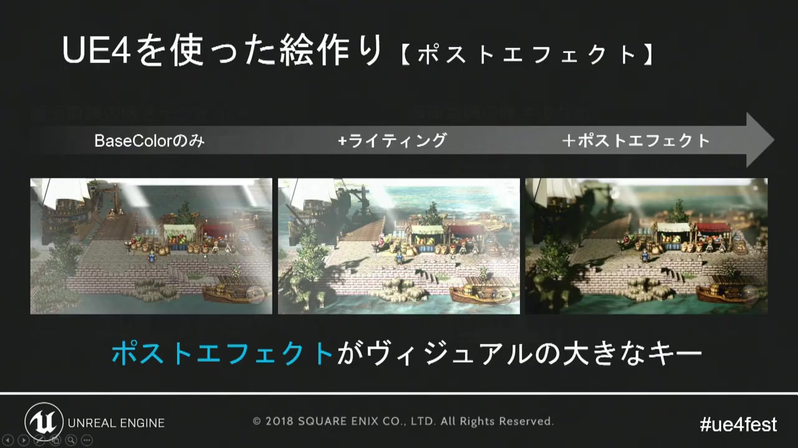
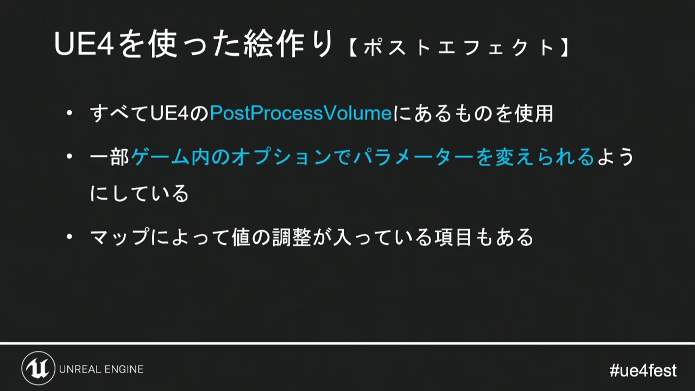
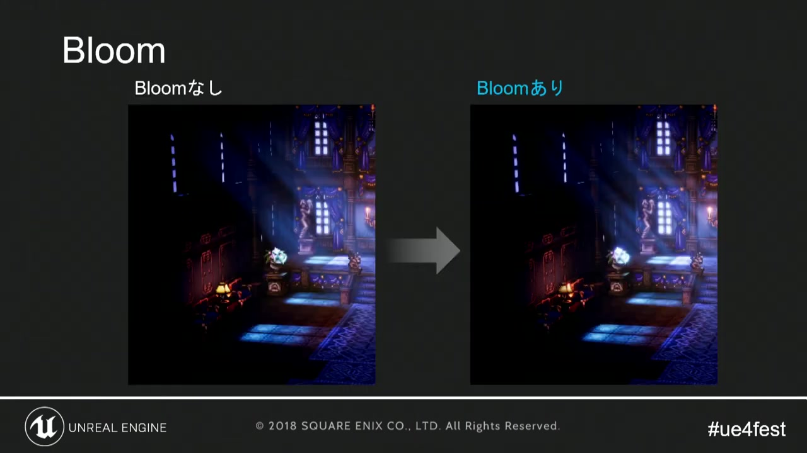
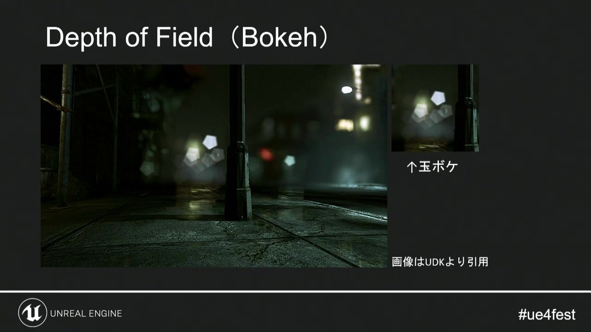
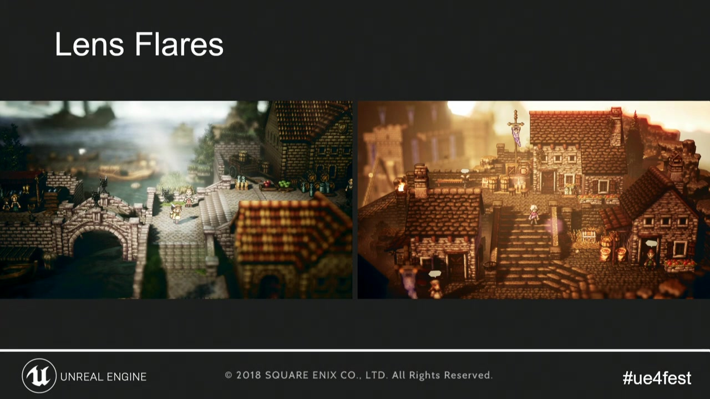
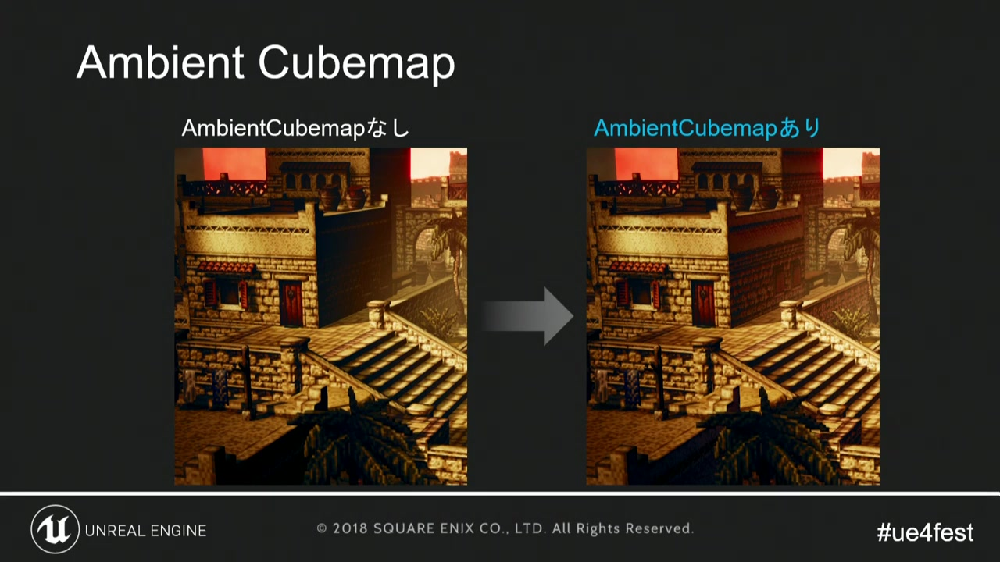
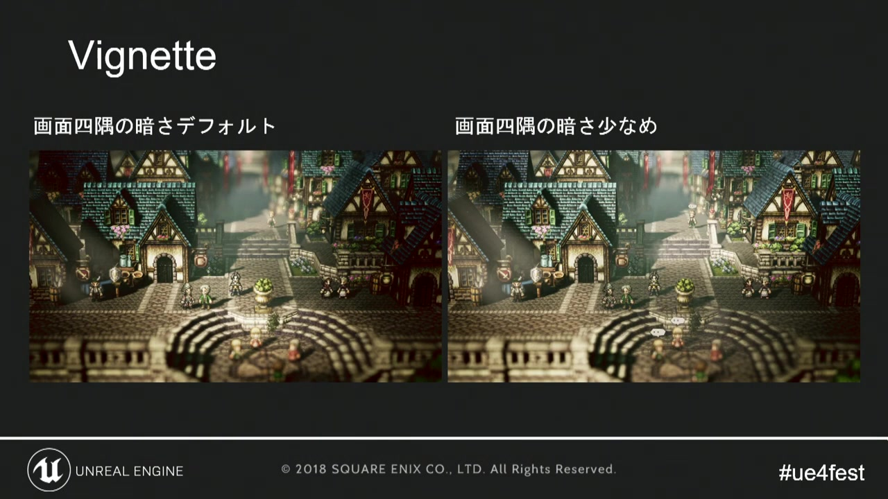

# 04. ポストプロセス

[前章：マテリアル／シェーダー表現](03_shader_techniques.md) ｜ [目次へ](../README.md) ｜ [次章：地形・町・室内](05_world_building.md)

**動画範囲:** おおよそ 21:30–25:10

## ポストプロセスはHD-2Dの大きな構成要素

講演では、Base Colorだけの状態から、ライティング、ポストプロセスを重ねるほど完成画面へ近づく比較が示されています。



*図1: Base Color、ライティング、ポストプロセスの順に画面情報が統合される。*

ただし、ポストプロセスは「高品質に見せるフィルター」ではありません。焦点、時間帯、空気感、画面端の視線誘導という目的ごとに使います。すべてを強くすると、ピクセルキャラクターの輪郭と色数が失われます。

## UE4とGodotの対応



*図2: UE4ではPostProcessVolumeを基盤に、ゲーム内からパラメーターを変更している。*

| 講演の項目 | Godot 4.7での実装 | 補足 |
|---|---|---|
| Color Grading | `Environment`のAdjustmentsとColor Correction Texture | 1D/3D LUTを利用できる |
| Bloom | `Environment`のGlow | HDR Threshold、Bloom、Levelsを調整 |
| Depth of Field | `CameraAttributesPractical`または`CameraAttributesPhysical` | Camera3Dへ設定するのが扱いやすい |
| Lens Flares | Sprite3D、GPUParticles3D、画面空間shader | 汎用レンズフレアを組み立てる必要がある |
| Ambient Cubemap | `Environment`のSky、Ambient Light、Reflected Light | 局所補正にはReflectionProbeを併用 |
| Vignette | `CompositorEffect`またはCanvasLayer上の画面shader | UIへ掛けるかをレイヤーで決める |
| PostProcessVolume | `WorldEnvironment`とCamera3D上書き | 複数Volumeの自動ブレンドは自前実装 |

## Bloomは「発光の結果」として使う



*図3: Bloomなし／ありの比較。明部が周囲へにじみ、光量感が増す。*

GodotではGlowを使います。Forward+では、発光ピクセルがHDR Thresholdを超えるか、GlowのBloom値で画面全体をGlow処理へ送ると効果が見えます。

調整順は次のとおりです。

1. Emissionを使う素材だけが十分に明るいか確認する。
2. HDR Thresholdを下げすぎず、発光対象が選別される値へ置く。
3. 小さいGlow Levelで輪郭付近、大きいLevelで霞を作る。
4. Intensityを最後に調整する。
5. 明るい昼、暗い室内、白いUIを同じ設定で確認する。

Glowを先に強くしてしまうと、白い床や空まで発光し、ピクセルの輪郭が太ります。発光対象のEmission値を設計し、Glowはその結果を撮影する工程と考えます。

## Depth of Fieldは焦点面の設計



*図4: 被写界深度によって手前と奥を整理し、小型模型のような距離感を作る。*

Godot 4では、露出とDOFが`Environment`ではなく`CameraAttributes`に分離されています。ゲーム用途では、任意単位で調整しやすい`CameraAttributesPractical`から始めるのが適しています。

HD-2Dでは次を守ります。

- プレイヤーの移動可能領域を焦点域に含める。
- 前景ボケがキャラクターへ重なる構図を実機で確認する。
- カメラ演出中に焦点距離を変える場合、瞬間変更ではなくTweenまたはAnimationPlayerで補間する。
- 解像度やレンダースケールを変えた画質設定ごとに、ボケの見かけ幅を確認する。
- UIは3D後処理の外に配置し、読める状態を保つ。

DOFを無効にした画面でも、光と色で奥行きが読めることが前提です。DOFだけで前景・中景・遠景を分けないでください。

## レンズ表現は光源との因果を保つ



*図5: 太陽方向の光を強調し、空気中の光量を感じさせる。*

Godotでは、カメラと主光源の方向関係から強度を計算し、Sprite3Dや画面空間shaderでフレアを描く方法が分かりやすいです。

- 光源が画面外へ出たら減衰する。
- 障害物に遮られたら消えるか弱くする。
- 太陽、強い魔法、演出上の主光源だけへ限定する。
- ピクセルキャラクターの顔へ恒常的に重ならないようにする。

装飾として常時表示すると、光源の位置と無関係なノイズになります。RayCast3Dや深度情報を使う場合は、見た目の価値に対してコストが妥当か測ります。

## Ambient Cubemap相当の環境光



*図6: 環境光の有無で、暗部の色と素材の読みやすさが変わる。*

Godotでは`Environment`のSkyを背景だけでなく、Ambient LightとReflected Lightの情報源にできます。屋外はSky、屋内は色または専用Sky、局所的な反射は`ReflectionProbe`という役割分担が基本です。

HD-2Dの暗部は完全な黒へ潰すより、時間帯や地域の色を残すと、ピクセルキャラクターと背景が馴染みます。ただし環境光を上げすぎると陰影が平坦になります。主光源を切った状態、環境光を切った状態、両方を重ねた状態を比較してください。

## Vignetteは視線誘導の量を決める



*図7: 画面端の暗さを調整し、中央へ視線を集める。*

VignetteはGodot標準Environmentの専用項目ではないため、`CompositorEffect`またはCanvasLayer上の全画面`ColorRect` shaderで実装します。単純な画面shaderは次のように作れます。

```glsl
shader_type canvas_item;

uniform float strength : hint_range(0.0, 1.0) = 0.25;
uniform float softness : hint_range(0.01, 1.0) = 0.45;

void fragment() {
    vec2 centered = UV * 2.0 - 1.0;
    float radius = length(centered);
    float edge = smoothstep(1.0 - softness, 1.0, radius);
    COLOR = vec4(0.0, 0.0, 0.0, edge * strength);
}
```

UIにも掛けたい場合と、3D画面だけへ掛けたい場合で配置を変えます。通常のプレイ画面では弱く、戦闘の溜めやイベントで一時的に強めるほうが、演出意図が明確になります。

## シーン別プロファイルと空間ブレンド

Godotではアクティブな`WorldEnvironment`を一つにし、町・洞窟・戦闘用の`Environment` Resourceを管理します。Camera3DへEnvironmentを設定すると優先されるため、一時的な戦闘演出やカットシーンの上書きに利用できます。

UE4のPostProcessVolumeのような空間ブレンドが必要なら、`Area3D`へ入ったときに数値をTweenします。Resourceそのものを毎フレーム複製せず、実行時用Environmentを一つ持ち、露出、Fog、Adjustmentなど必要なプロパティだけを補間します。

## 検証表

| 状態 | 確認すること |
|---|---|
| 全効果OFF | 素材、構図、直接光だけで操作対象が読める |
| Glowのみ | 発光対象以外がにじんでいない |
| DOFのみ | プレイヤーの移動範囲が焦点域にある |
| 色調整のみ | 肌、HP色、状態異常色が識別できる |
| すべてON | 白飛び、黒潰れ、色段差が増えていない |
| UI表示 | UIがGlow・DOF・Vignetteに巻き込まれない |
| 低画質設定 | 効果を減らしてもゲーム情報が変わらない |

## 公式資料

- [Environment and post-processing](https://docs.godotengine.org/en/latest/tutorials/3d/environment_and_post_processing.html)
- [The Compositor](https://docs.godotengine.org/en/latest/tutorials/rendering/compositor.html)
- [Custom post-processing](https://docs.godotengine.org/en/stable/tutorials/shaders/custom_postprocessing.html)

---

[前のページ：03. マテリアル／シェーダー表現](03_shader_techniques.md) ｜ [目次へ](../README.md) ｜ **次のページ:** [05. 地形・町・室内](05_world_building.md)
