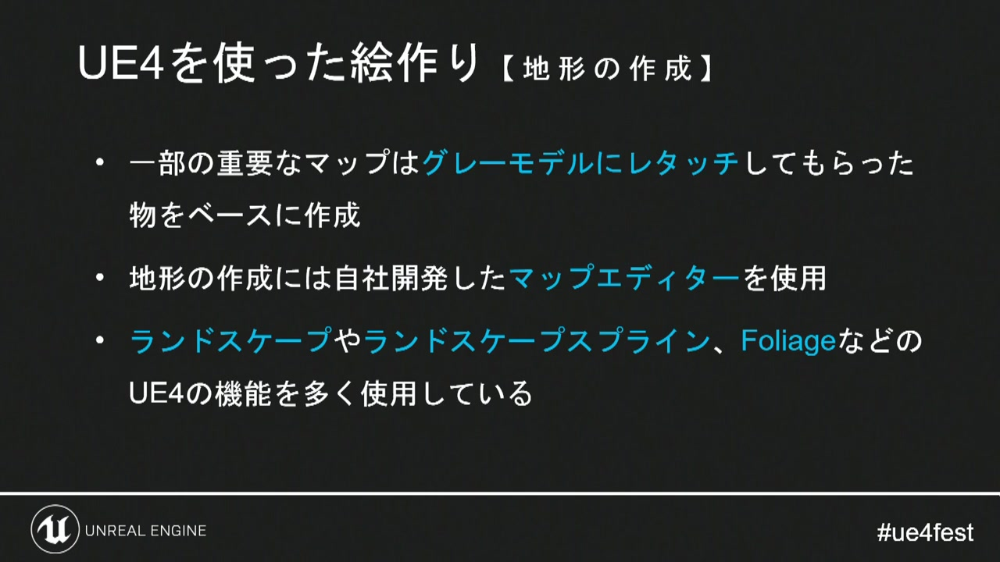
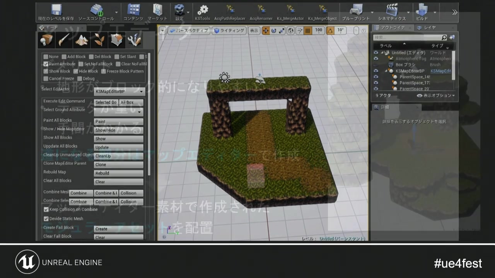
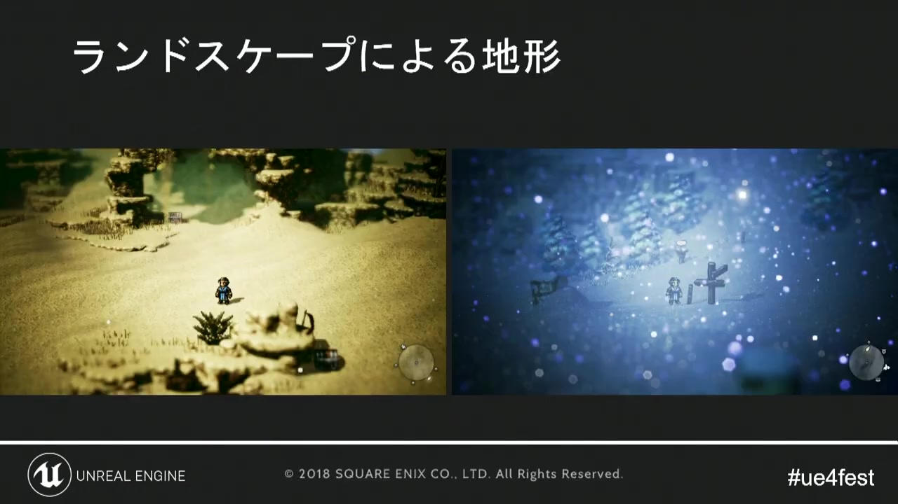
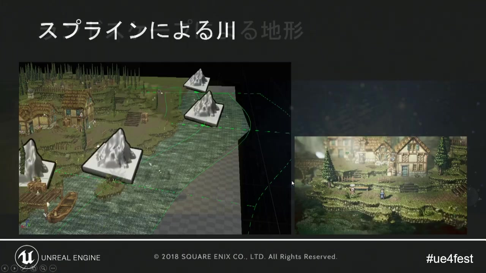
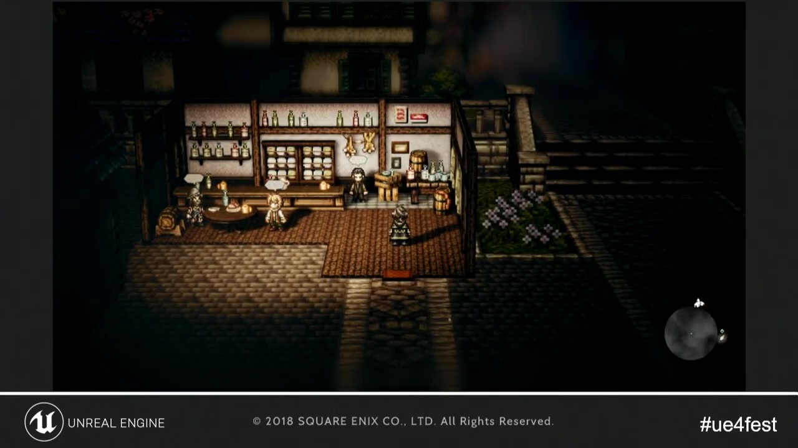
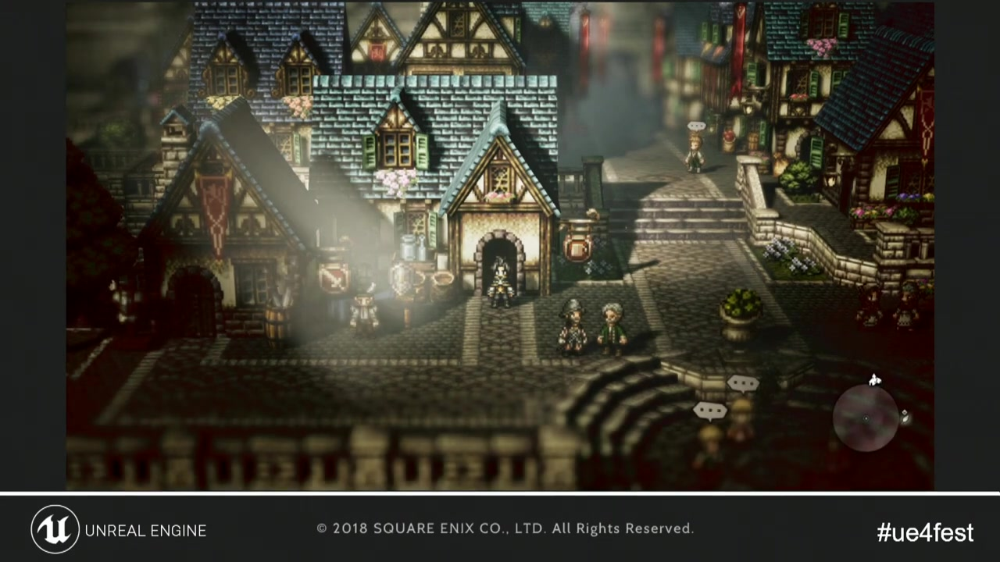

# 05. 地形・町・室内

[前章：ポストプロセス](04_post_processing.md) ｜ [目次へ](../README.md) ｜ [次章：バトル演出](06_battle_direction.md)

**動画範囲:** おおよそ 25:10–31:25

## 背景制作の中心は、構図と反復速度

講演では、重要マップの一部をグレーモデルから手作業でレタッチし、その見た目を基準に量産しています。また、地形がブロック状になりやすく、データが重く、制作に時間がかかるという課題に対して、専用マップエディター、Landscape、Spline、Foliageなどを使い分けています。



*図1: 代表シーンは、簡素な立体から完成画の基準を手作業で確立する。*

ここから得られる原則は、すべてを同じ制作手段へ統一しないことです。繰り返す地形、主役となる建築、曲線を持つ川、前景の草木では、最適な表現と編集方法が異なります。

## グレーモデルから基準シーンを作る

Godotでの初期ブロックアウトには、単純な`MeshInstance3D`、プリミティブMesh、`CSGBox3D`などを使えます。CSGは試作には便利ですが、完成シーンでは通常のMeshへ置き換え、描画、コリジョン、ライトベイクの条件を確定します。

基準シーンでは次を順番に決めます。

1. 地面の高さと移動可能領域
2. Camera3Dの構図と遮蔽
3. キャラクターに接する扉、階段、橋の縮尺
4. 主光源と環境光
5. 前景・中景・遠景の色とコントラスト
6. DOF、Fog、Glowなどの撮影効果

代表シーンをコンセプトアートの再現だけで終わらせず、モジュール寸法、Material、Light、Environmentの標準値を抽出する「量産仕様の検証場」にします。

## モジュール式マップエディター



*図2: モジュールアセットを配置し、手作業の反復を短縮する。*

Godotでは、用途に応じて二つの方法があります。

### GridMap

床、壁、崖、橋など、グリッドへ沿う部品を`MeshLibrary`へ登録します。配置が速く、衝突形状やナビゲーションも部品へ含められます。

向いているもの:

- ダンジョンの床・壁
- 段差の規格が決まった崖
- 反復する橋、柵、柱
- ゲームプレイ上のセルが明確な場所

注意点:

- 形状とテクスチャの反復が見えやすい
- 全部をグリッドへ合わせると、講演で指摘されたブロック感が出る
- 大きなGridMap一つより、カリングと編集単位を考えたチャンク分割が必要

### PackedSceneの配置ツール

建物、木、屋台などを個別の`PackedScene`として作り、`@tool`スクリプトやEditorPluginでパレット配置します。ランダムな回転、Scale、Material Variant、地面へのスナップを追加できます。

配置データをNodeとして大量に保持するか、軽量な配列として保存して実行時に`MultiMesh`へ変換するかは、編集性と実行性能のトレードオフです。最初から一つへ決めず、編集用データと実行用データを分ける設計が安全です。

## 地形 — Landscape相当をどう作るか



*図3: 滑らかな地形と起伏により、ブロック感を崩す。*

Godot標準にはUE4 Landscapeと同等の統合地形エディターはありません。規模と目的に応じて選びます。

| 方法 | 向く規模 | 長所 | 注意点 |
|---|---|---|---|
| DCCで作成したMesh | 小～中規模、固定構図 | 形とUVを完全制御 | 修正の往復が必要 |
| GridMap + 装飾Mesh | セル型マップ | 高速な編集 | ブロック感を崩す追加工程が必要 |
| 高さマップから手続きMesh | 広い地表 | 自動化しやすい | 崖、洞窟、オーバーハングに弱い |
| 地形アドオン | 大規模地形 | 編集・LOD機能を補える | 対応Godot版、保守性、Export先を検証 |

HD-2Dではカメラ範囲が限定される場合が多いため、巨大な汎用地形より、ショットごとに制御できる中規模Meshのほうが最終画を詰めやすいことがあります。

## Splineによる川と道



*図4: 曲線を使って川の経路を編集し、直線的な地形の反復を崩す。*

Godotでは`Path3D`の`Curve3D`を編集し、曲線に沿って帯状Meshを生成します。`Path3D`自体は描画しないため、EditorPluginまたは`@tool`スクリプトで次を生成します。

- 曲線を一定距離でサンプリング
- 接線と上方向から左右の頂点を計算
- 川幅、深さ、UV距離をカーブ上の値から決定
- `SurfaceTool`または`ArrayMesh`で帯状Meshを生成
- 必要なら岸辺の草、石、泡の配置点も生成

UVは区間番号ではなく曲線に沿った累積距離から作ると、カーブの分割密度を変えても水面速度が一定になります。見た目の水面とは別に、移動不可領域や水深判定用のCollision／Navigationコストも管理します。

## 室内と屋外の切り替え



*図5: 室内では視認性とスケールを保つため、ライティング、ポストプロセス、表示物、カメラを切り替える。*

講演では室内と室外をシームレスに切り替え、ドアのトリガーでライト、ポストプロセス、表示オブジェクト、カメラ、キャラクターサイズを切り替えています。

Godotでは`Area3D`を入口へ置き、次を一つの遷移コントローラーから変更します。

- 屋外／屋内`PackedScene`の表示・ロード
- LightingRigの有効化とLight Energy
- EnvironmentのFog、Adjustments、Glow
- CameraRigの位置、FOV、制限範囲
- 前景屋根や壁の表示
- 必要ならVisualPivotの見かけScale
- Audio Busや環境音

個々のArea3Dから直接多数のNodePathを参照すると、マップ変更に弱くなります。Areaは`interior_entered(profile_id)`のようなSignalだけを出し、マップ側のコントローラーが実ノードを操作します。

## 町の完成画から読むレイヤー



*図6: 前景のボケ、中景のプレイヤー、遠景の光と建物が奥行きを作る。*

完成画をノード構成へ分解すると、次のようになります。

```text
TownRoot
├── WorldGeometry
│   ├── Terrain
│   ├── Architecture
│   └── Occluders
├── Decorations
│   ├── MultiMeshFoliage
│   └── UniqueProps
├── Characters
├── LightingRig
├── WorldEnvironment
├── CameraRig
├── NavigationRegion3D
└── InteriorController
```

`MultiMeshInstance3D`は同一Meshを大量に描くのに向きますが、個別インスタンスのカリングやNode固有のロジックは失われます。草木を一つの巨大MultiMeshへまとめず、視界やマップチャンク単位に分けます。

## 背景制作の検証項目

- [ ] Camera3Dを固定したまま、主要な移動経路が読める
- [ ] グリッド部品の反復が、地形、装飾、光で適度に崩れている
- [ ] 前景オブジェクトがキャラクターを隠す場合の処理がある
- [ ] アルファ素材のソートと影がカメラ全域で破綻しない
- [ ] 屋内／屋外の遷移中にEnvironmentが瞬間変化しない
- [ ] Collisionと見た目の段差が一致している
- [ ] Navigation Meshの再Bake条件を制作手順に含めている
- [ ] 繰り返し装飾をNode、MultiMeshのどちらで持つか計測している

## 公式資料

- [GridMap](https://docs.godotengine.org/en/stable/classes/class_gridmap.html)
- [Path3D](https://docs.godotengine.org/en/stable/classes/class_path3d.html)
- [Optimization using MultiMeshes](https://docs.godotengine.org/en/stable/tutorials/performance/using_multimesh.html)

---

[前のページ：04. ポストプロセス](04_post_processing.md) ｜ [目次へ](../README.md) ｜ **次のページ:** [06. バトル演出](06_battle_direction.md)
