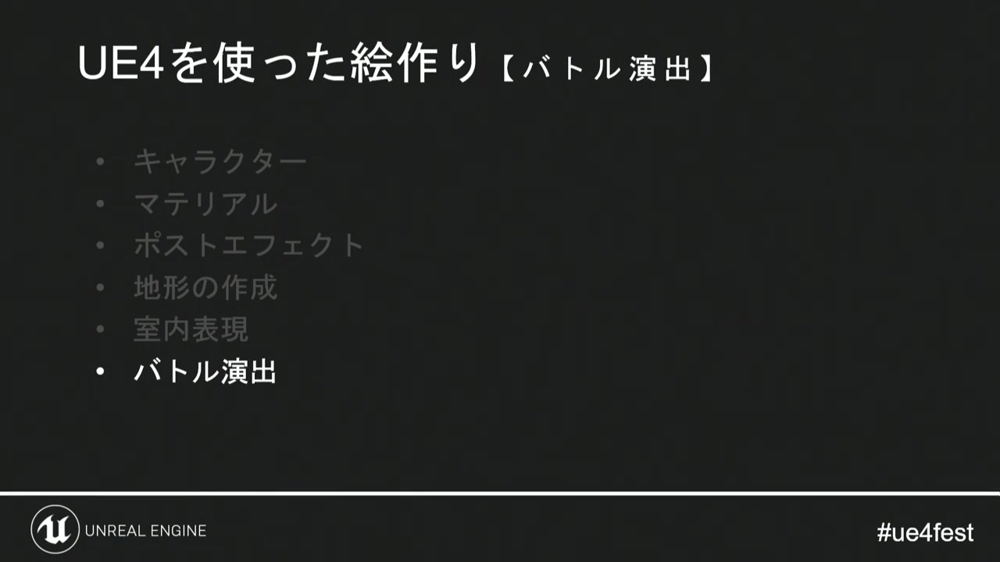
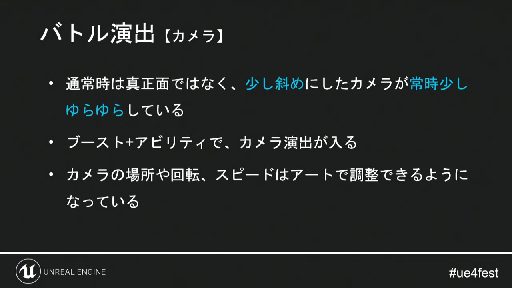
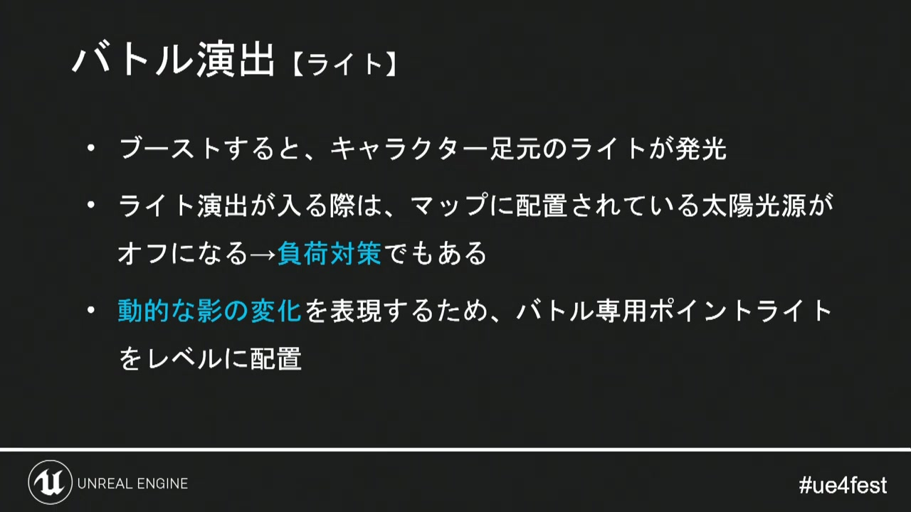
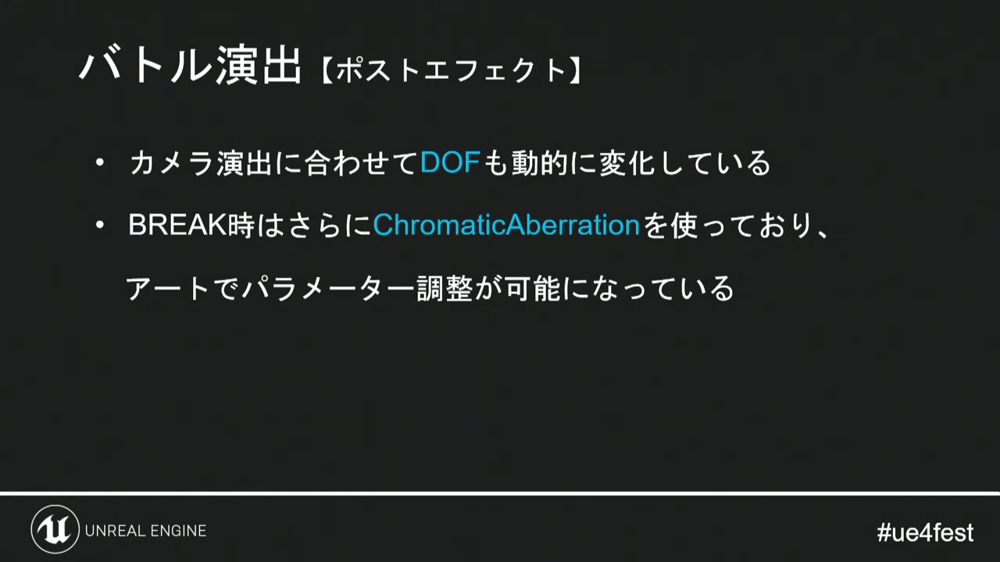
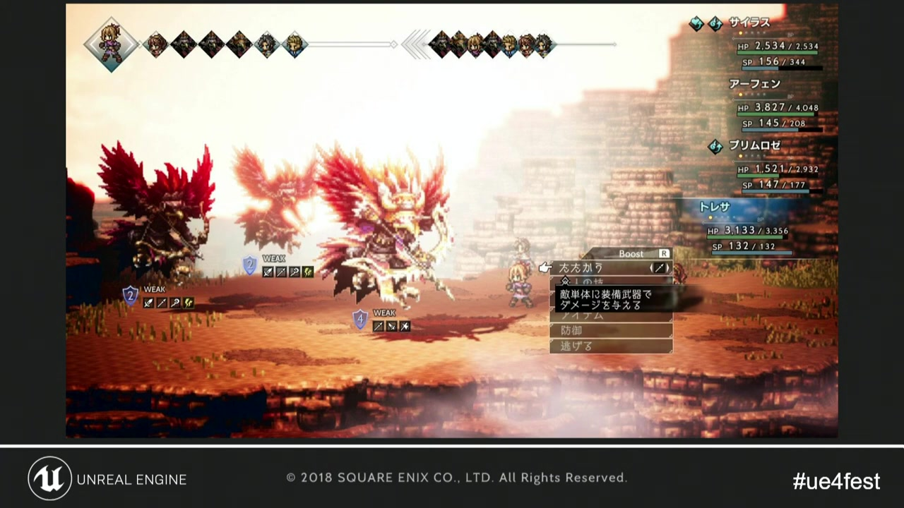

# 06. バトル演出

[前章：地形・町・室内](05_world_building.md) ｜ [目次へ](../README.md) ｜ [次章：起動時間と参照設計](07_loading_and_references.md)

**動画範囲:** おおよそ 31:25–35:10

## バトルは通常画面と別の撮影ルールを持つ

講演のバトル演出は、カメラ、ライト、ポストプロセスを動的に変えています。通常時のフィールド設定を強くするのではなく、コマンド、ブースト、アビリティ、BREAKなどのイベントに合わせて一時的な撮影状態を作るのが要点です。



*図1: キャラクター、マテリアル、ポストプロセス、地形、室内に続く、画づくりの最終項目。*

## カメラ — 静止構図の中に呼吸を作る



*図2: 通常時もわずかに斜めのカメラがゆっくり揺れ、ブーストやアビリティで専用演出へ移る。*

Godotでは、Camera3Dを直接あちこちから操作せず、`BattleCameraRig`へ要求を集約します。

```text
BattleCameraRig
├── BasePivot          通常構図
│   └── ShakePivot     揺れ・反動
│       └── Camera3D
└── AnimationPlayer    決められたショット
```

- 通常時の呼吸は、低周波・小振幅の位置と注視点変化にする。
- アビリティは`AnimationPlayer`で再現可能なショットとして作る。
- 被弾シェイクは`ShakePivot`だけへ加算し、ベース構図を壊さない。
- カメラの回転、移動速度、FOVはResourceにしてアート側から調整する。
- 入力受付や命中判定の時間と、カメラ演出の時間を分離する。

Sprite3Dはカメラのわずかな移動でも画面上のピクセル位置が変化します。細かいカメラノイズは「映画的な揺れ」より先にピクセルのちらつきとして見えるため、最終解像度で確認します。

## ライト — 状態変化を局所的に見せる



*図3: ブースト中は足元を発光させ、マップの太陽光を一時的に弱め、専用ポイントライトを配置する。*

Godotでは、フィールド用`DirectionalLight3D`のEnergyと、演出用`OmniLight3D`／`SpotLight3D`を組み合わせます。

実装順:

1. キャラクター本体または足元のEmissionを上げる。
2. 周囲へ光が必要な場合だけ、演出用Lightを有効にする。
3. 主光源を完全に消すのではなく、コントラストが保たれる値へ補間する。
4. Lightの色、Energy、Rangeをアビリティデータから設定する。
5. 演出終了時に、参照カウント式または状態スタックで元へ戻す。

複数演出が重なったとき、最後に終わった演出が主光源を誤って初期値へ戻さないようにします。「通常値を保存して戻す」より、アクティブな演出要求を合成して毎フレーム目標値を求める方式が安全です。

## ポストプロセス — ゲームイベントへ同期する



*図4: カメラ演出に合わせてDOFを動かし、BREAK時にはChromatic Aberrationを追加する。*

Godotでの対応は次のとおりです。

- DOF: Camera3Dの`CameraAttributesPractical`を実行時用Resourceとして補間
- 露出・色・Glow: 実行時用`Environment`の必要項目だけを補間
- Chromatic Aberration: `CompositorEffect`または画面全体のcanvas_item shader
- 一時停止風の強調: Engineの時間を止めず、対象AnimationPlayerの速度と演出時間を分離

Chromatic Aberrationは文字やピクセル輪郭を崩しやすいため、短時間かつ画面端中心に限定します。色ずれ量を解像度非依存のUV値だけで決めると、画質設定で見え方が変わるため、画面ピクセル換算も確認します。

## 演出をデータ駆動にする

アビリティごとにコードを増やさず、撮影指示をResource化します。

```gdscript
class_name BattleShotProfile
extends Resource

@export var duration: float = 0.6
@export var camera_offset: Vector3 = Vector3.ZERO
@export var camera_fov: float = 35.0
@export var dof_blur_far_distance: float = 12.0
@export var key_light_energy_scale: float = 0.5
@export var effect_light_color: Color = Color.WHITE
@export var effect_light_energy: float = 0.0
@export var chromatic_aberration: float = 0.0
```

`BattlePresentationController`はゲームロジックから`play_shot(profile, targets)`を受け取り、CameraRig、LightingRig、PostProcessRigへ配ります。命中判定は演出側のAnimation callbackに依存させず、ゲームロジックのタイムラインを正とします。

## 完成画を分解する



*図5: 明るい背景、キャラクターの色ずれ、局所光、エフェクトが短い瞬間に集中する。*

この画面の情報量は常時表示には強すぎます。演出の前後で次のリズムを作ります。

```text
通常構図
  → 予備動作（カメラと光を寄せる）
  → 命中フレーム（最大の光・色ずれ・停止感）
  → 余韻（Glowと粒子だけを残す）
  → 通常構図へ復帰
```

最大効果の瞬間だけでなく、復帰時にカメラ、Environment、Lightが正しく通常値へ戻ることを自動テスト対象にします。

## バトル演出の品質基準

- [ ] エフェクトを切っても敵味方の位置と行動順が読める
- [ ] 最大発光時もHP、弱点、ターゲット表示が読める
- [ ] 連続攻撃でカメラシェイクが無制限に加算されない
- [ ] 複数の演出要求が重なっても通常状態へ復帰する
- [ ] 30fps／60fpsの両方でTweenの時間と命中タイミングが一致する
- [ ] 低画質設定でCompositorEffectを切っても意味が変わらない
- [ ] 戦闘の開始・終了時に専用ResourceとLightが解放される

---

[前のページ：05. 地形・町・室内](05_world_building.md) ｜ [目次へ](../README.md) ｜ **次のページ:** [07. 起動時間と参照設計](07_loading_and_references.md)
