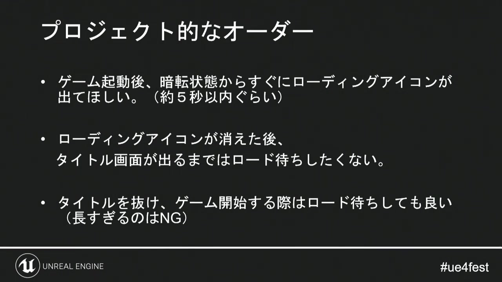
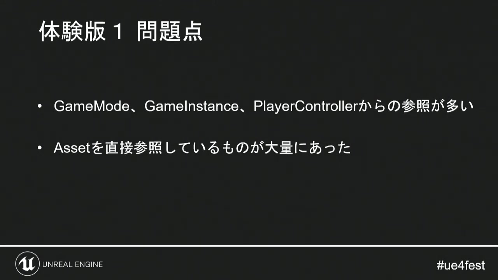
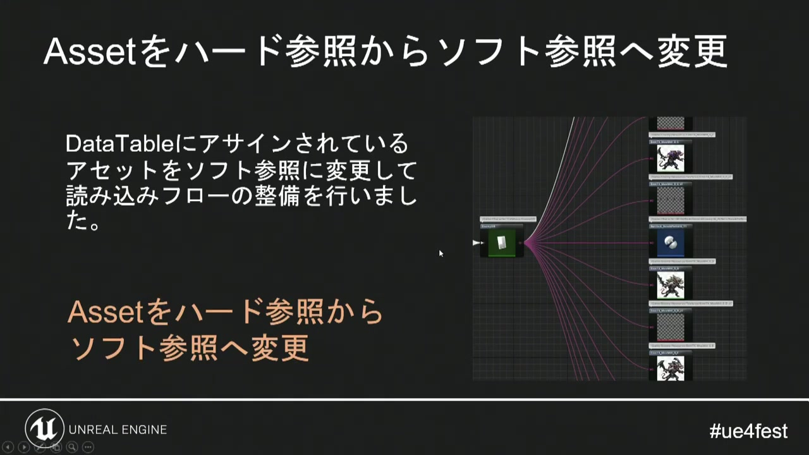
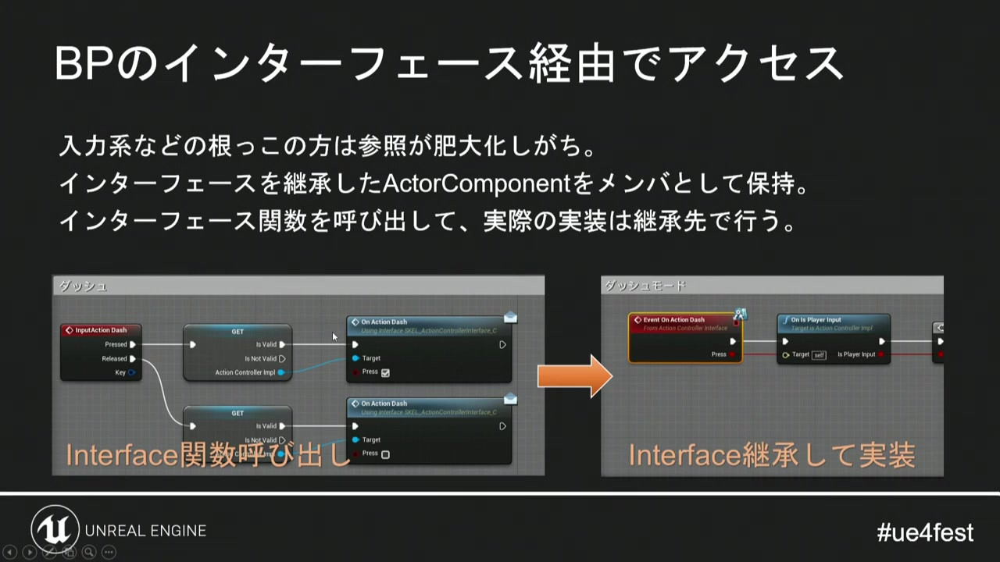
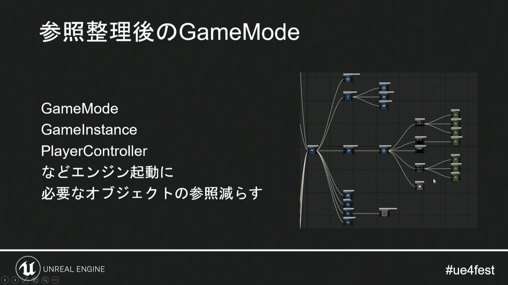
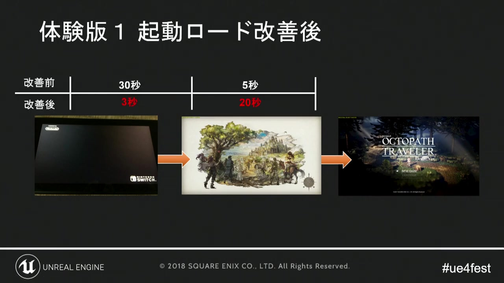
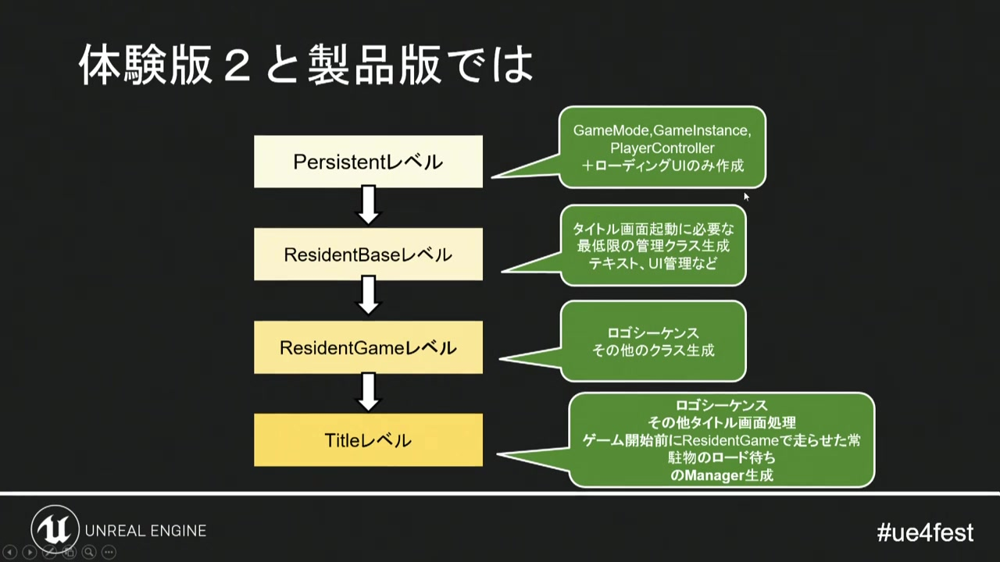
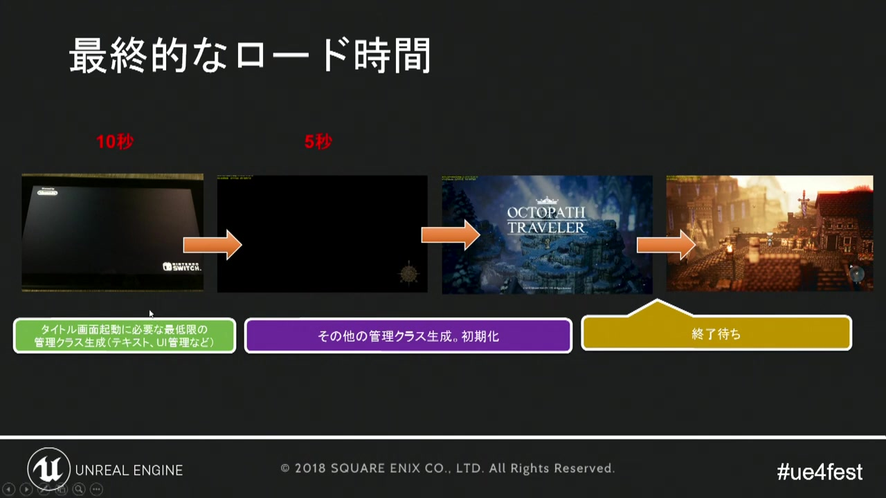

# 07. 起動時間と参照設計

[前章：バトル演出](06_battle_direction.md) ｜ [目次へ](../README.md) ｜ [次章：スプライトアニメーションのメモリ](08_sprite_memory.md)

**動画範囲:** おおよそ 36:10–45:30

## 起動時間は参照グラフの結果

講演の目標は、起動後すぐにローディング表示を出し、短い待ち時間でタイトルへ進み、ゲーム開始時のロードは許容するというものです。重要なのは、単にロード画面を追加するのではなく、どの段階で何を必要とするかを設計することです。



*図1: 最初の反応を速くし、重い読み込みを明示的な待機区間へ移す。*

Godotでも、起動時に遅いスクリプトが一つあるとは限りません。Autoload、最初のPackedScene、Resourceの依存先、shaderコンパイル、音声、テクスチャのImport形式などが連鎖して時間を作ります。

## 動画で起きていた問題



*図2: GameMode、GameInstance、PlayerControllerからの参照が多く、Assetの直接参照が大量にあった。*

UE4では、起動時に必要な主要オブジェクトからコンテンツAssetへハード参照が伸び、参照先が連鎖的にロードされていました。Godotで同じ問題を起こす代表例は次のとおりです。

- Autoload scriptの定数で多数の`preload()`を行う
- 最初の`.tscn`へ、全キャラクターや全UIを外部Resourceとして割り当てる
- マスターデータResourceが、各行からTexture、AudioStream、PackedSceneを直接参照する
- タイトル画面の管理Nodeがフィールドや戦闘シーンを直接保持する
- 共通UIテーマやMaterialが、不要な巨大Textureへ依存する
- 一つのResourceへ全ジョブ、全言語、全アニメーションを集約する

## Godotにおける「ハード参照」と「ソフト参照」



*図3: データの整理と、必要になるまでAssetを読まない参照方式への変更。*

Godotに公式な「Soft Object Reference」という単一型があるわけではありません。本書では、次のように区別します。

| 種類 | 例 | 読み込み時期 | 用途 |
|---|---|---|---|
| コンパイル時の直接参照 | `const ICON := preload("res://icon.png")` | scriptがロードされるとき | 常に必要な小規模Resource |
| Scene／Resourceの直接参照 | InspectorでTextureやPackedSceneを割当 | 所有Resourceの依存解決時 | 同時に必要な依存 |
| 実行時ロード | `load(path)` | 呼び出した時点 | 小規模で即時に必要 |
| 遅延・非同期ロード | パスまたはUID + `ResourceLoader.load_threaded_request()` | 明示した区間 | 大きなScene、Texture、音声 |

文字列パスはAsset本体を直ちに参照しませんが、パス変更への追従と型安全性が弱くなります。GodotのResource UIDを利用できる運用ではUIDを保存し、Editorでの移動耐性を高めます。どちらの場合も、存在確認、型確認、ロード失敗時のフォールバックを用意します。

## 依存方向をインターフェースで止める



*図4: 実体を保持せず、必要な機能だけをインターフェース経由で呼ぶ。*

Godotでは、Signal、Callable、グループ、軽量なサービスAPIを使って依存方向を制御します。

悪い例:

```text
SaveService（Autoload）
└── BattleScene
    └── AllEnemies
        └── AllSpriteFrames
```

良い例:

```text
SaveService（Autoload）
└── 保存可能なDictionaryだけを扱う

BattleCoordinator（BattleScene内）
├── 必要なenemy_idを受け取る
└── enemy_idから、その戦闘で必要なSceneだけをロードする
```

共通サービスはコンテンツの型やSceneを知らず、ID、Dictionary、Signalなどの境界データだけを扱います。



*図5: 起動に必要なオブジェクト同士だけを残し、参照グラフを小さくする。*

## 非同期でPackedSceneをロードする

```gdscript
extends Node

signal load_progress_changed(progress: float)
signal scene_loaded(scene: PackedScene)
signal load_failed(path: String)

var _requested_path: String = ""

func request_scene(path: String) -> void:
    _requested_path = path
    var error: Error = ResourceLoader.load_threaded_request(
        path,
        "PackedScene",
        true
    )
    if error != OK:
        load_failed.emit(path)
        _requested_path = ""

func _process(_delta: float) -> void:
    if _requested_path.is_empty():
        return

    var progress: Array = []
    var status: int = ResourceLoader.load_threaded_get_status(
        _requested_path,
        progress
    )

    if not progress.is_empty():
        load_progress_changed.emit(float(progress[0]))

    if status == ResourceLoader.THREAD_LOAD_LOADED:
        var loaded: Resource = ResourceLoader.load_threaded_get(_requested_path)
        if loaded is PackedScene:
            scene_loaded.emit(loaded as PackedScene)
        else:
            load_failed.emit(_requested_path)
        _requested_path = ""
    elif status == ResourceLoader.THREAD_LOAD_FAILED:
        load_failed.emit(_requested_path)
        _requested_path = ""
```

`load_threaded_get()`は、完了前に呼ぶと待機する可能性があります。`load_threaded_get_status()`をフレームごとに確認し、`THREAD_LOAD_LOADED`になってから取得します。ロード済みSceneをシーンツリーへ追加する操作はメインスレッドで行います。

## 常駐レイヤーを明確にする



*図6: 初期区間、タイトル用区間など、必要なロードを段階へ分離する。*



*図7: Persistent、ResidentBase、ResidentGame、Titleの各レベルで常駐範囲を分けている。*

Godotでの推奨分割は次のとおりです。

| レイヤー | 内容 | 参照してよいもの |
|---|---|---|
| Boot | 最小ロゴ、エラー表示、ロードUI | 小さいFont、Texture、次のパス |
| Core | 入力、保存、音声ルーター、設定 | コンテンツIDと軽量設定 |
| Frontend | タイトル、オプション、セーブ選択 | UI用Resource、プレビュー画像 |
| Game | フィールド／戦闘の制御 | 現在の章・マップで必要なデータ |
| Location | 現在地の地形、NPC、音声 | 現在地固有のResource |

AutoloadはCoreへ相当します。便利だからという理由でキャラクター辞書や全Sceneを置かず、「終了まで存在する必要があるか」「Assetを直接参照せずに済むか」で判断します。

## ロード中に行うことを分ける

ロード進捗には少なくとも三種類があります。

1. **ディスク／Resourceロード:** `ResourceLoader`が報告できる。
2. **Sceneのinstantiateとシーンツリー追加:** メインスレッド側の処理時間。
3. **初回描画:** shader、パイプライン、テクスチャ転送などで初回だけ重くなる可能性がある。

プログレスバーを1だけで100%にすると、その後のinstantiateで停止して見えます。工程ごとに予算を持ち、ロード完了後も次の1フレームで即座に全Nodeを追加せず、演出上許される範囲で段階化します。

## 改善結果をどう読むか



*図8: すぐ表示できる区間、裏で読み込む区間、ゲーム開始前の待機区間を分けた最終像。*

目標は総時間を隠すことではありません。入力に対する最初の反応を速くし、待機理由を画面へ示し、重い処理をユーザーが予測できる区間へ移します。

## 計測手順

ロード時間は次を分けて記録します。

- Editor実行とExportビルド
- 初回起動と2回目以降
- DebugとRelease
- SSDと対象となる低速ストレージ
- Import済みキャッシュあり／なし
- Boot表示、タイトル表示、入力可能、フィールド表示、操作可能の各時刻

タイマーだけでなく、どのScene／Resourceをロードしたかをログへ残します。改善前後で参照グラフが変わったか、機能が単に後ろへ移っただけかを確認します。

## 参照設計チェックリスト

- [ ] Boot Sceneがゲーム本編のPackedSceneや巨大Textureを直接参照していない
- [ ] Autoloadが全コンテンツを`preload()`していない
- [ ] マスターデータが表示用Textureを直接保持する必要性を検討した
- [ ] `ResourceLoader.load_threaded_get()`を完了前に呼んでいない
- [ ] ロード失敗、パス変更、型不一致のフォールバックがある
- [ ] Sceneのinstantiate時間と初回描画時間を別々に測っている
- [ ] タイトルへ戻った後、フィールド固有Resourceへの参照が残っていない

## 公式資料

- [ResourceLoader](https://docs.godotengine.org/en/latest/classes/class_resourceloader.html)
- [PackedScene](https://docs.godotengine.org/en/stable/classes/class_packedscene.html)
- [Thread-safe APIs](https://docs.godotengine.org/en/latest/tutorials/performance/thread_safe_apis.html)

---

[前のページ：06. バトル演出](06_battle_direction.md) ｜ [目次へ](../README.md) ｜ **次のページ:** [08. スプライトアニメーションのメモリ](08_sprite_memory.md)
