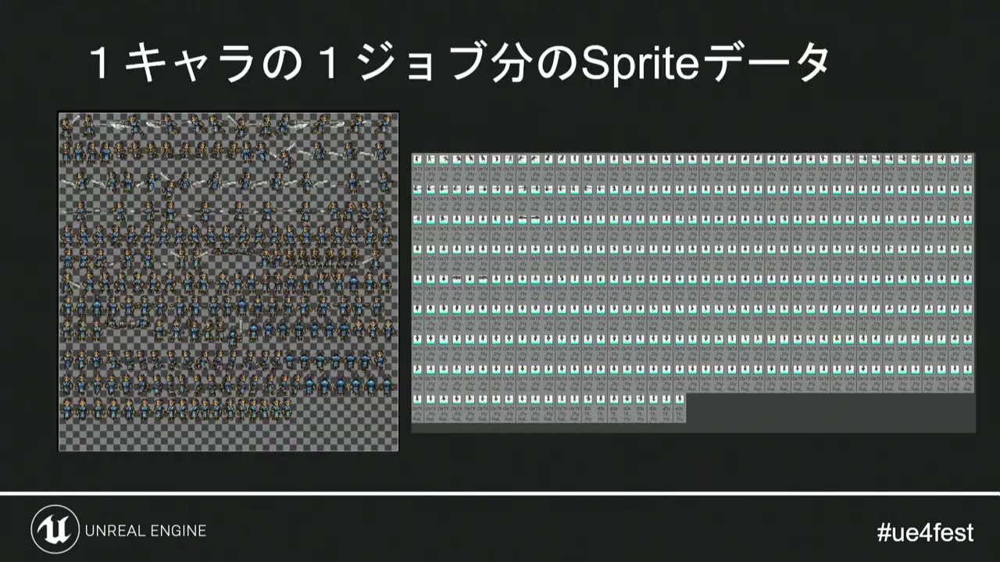
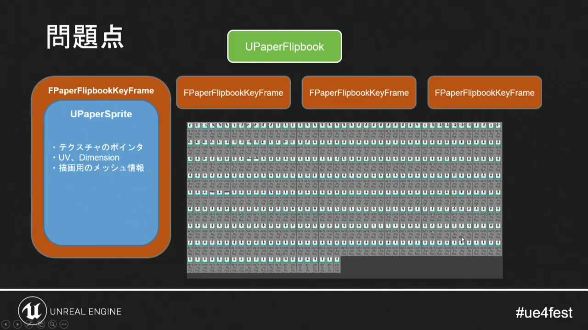
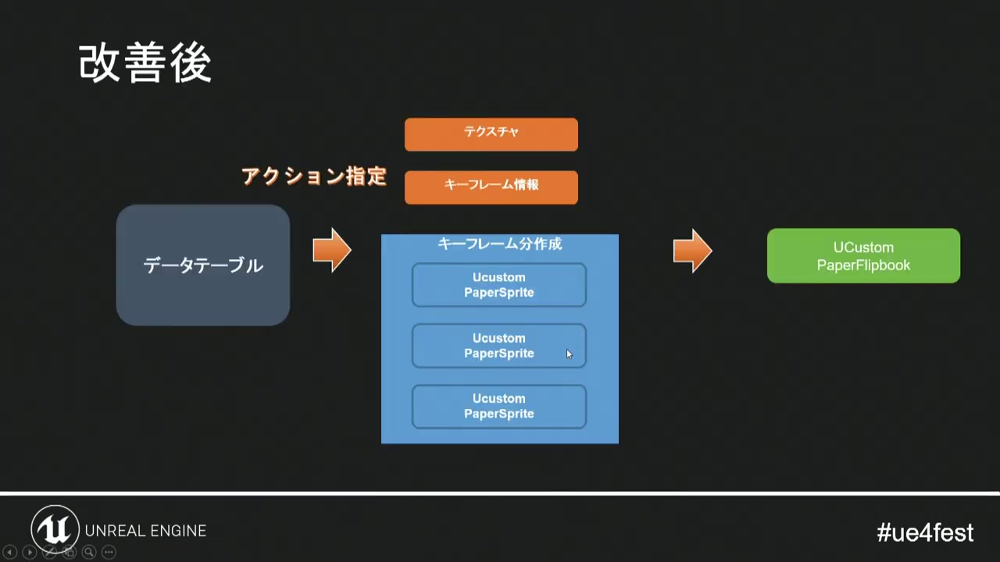
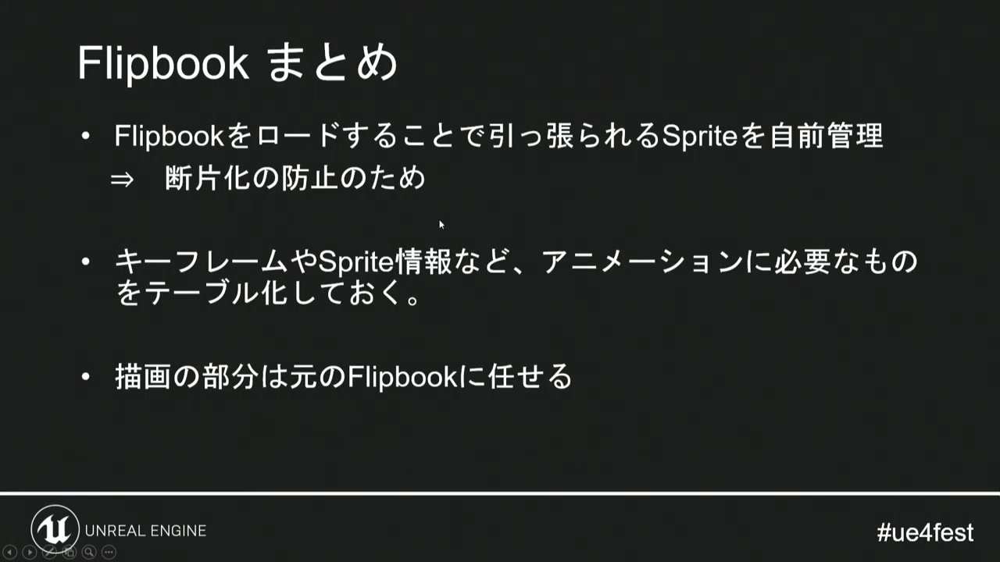
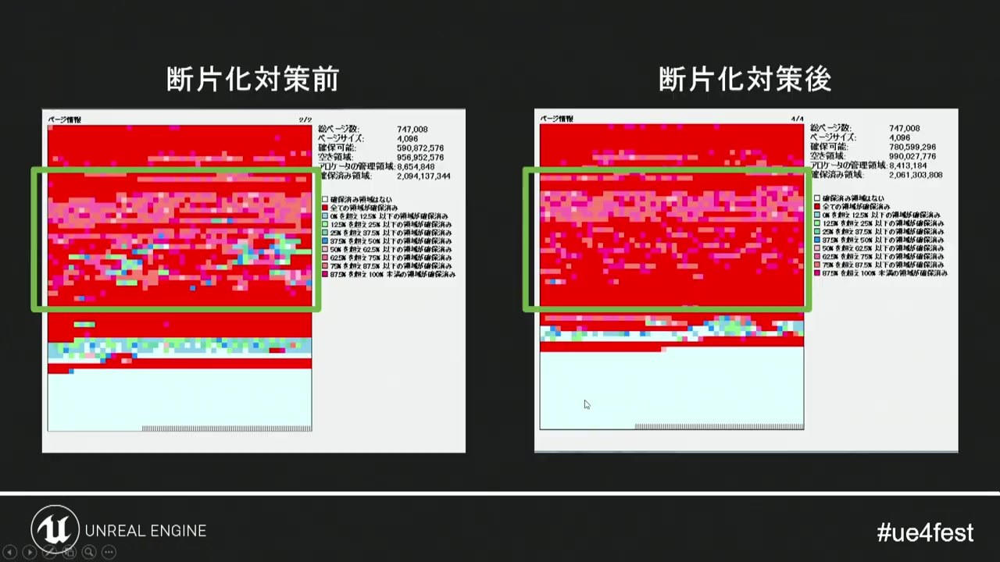
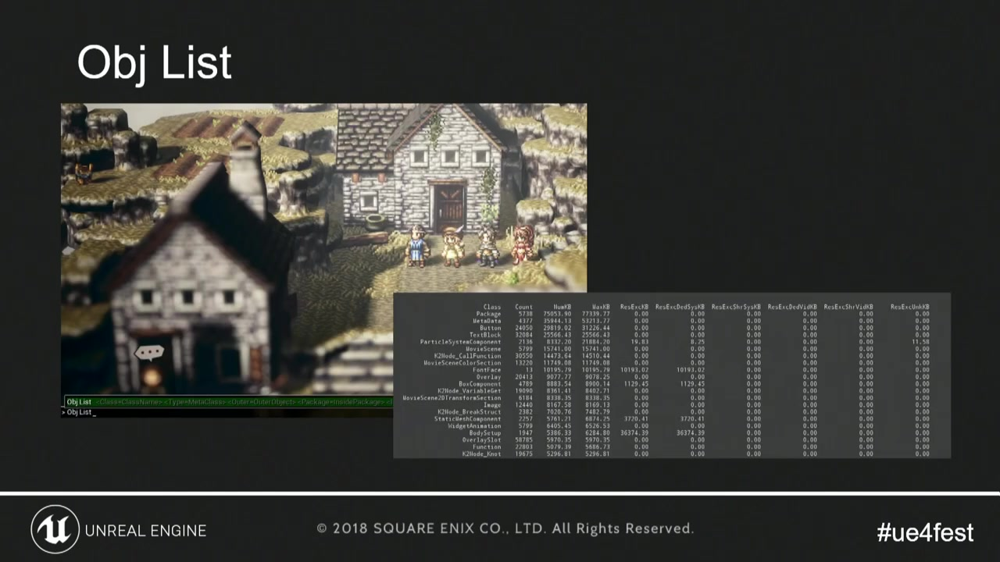
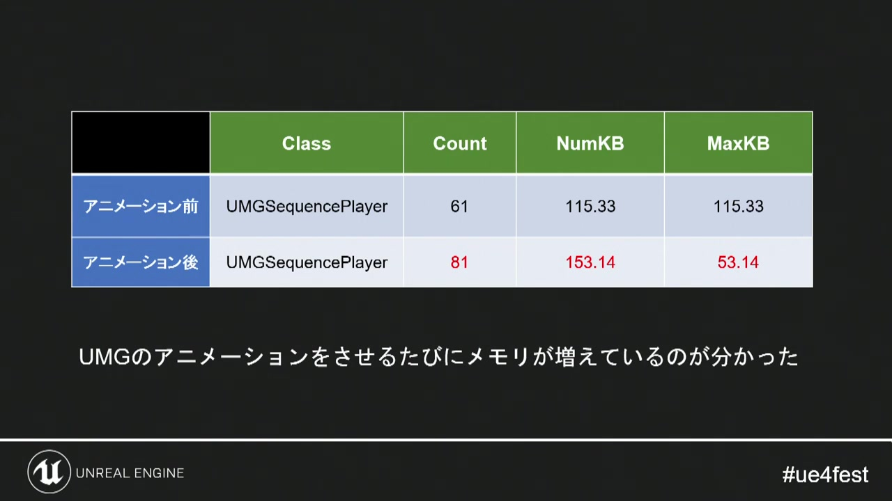

# 08. スプライトアニメーションのメモリ

[前章：起動時間と参照設計](07_loading_and_references.md) ｜ [目次へ](../README.md) ｜ [次章：オブジェクト寿命と性能計測](09_lifecycle_and_profiling.md)

**動画範囲:** おおよそ 45:30–52:00

## 問題は「何枚あるか」だけではない

講演では、PaperFlipbookを読み込むと、そのFlipbookに紐づくPaperSpriteが大量にロードされ、メモリが増えていました。キャラクターとジョブの組み合わせが増えるほど、アニメーションフレーム、Sprite情報、管理オブジェクトが連鎖します。



*図1: 1組だけでも多数のフレームがあり、キャラクターとジョブの積で増える。*

HD-2Dはキャラクターの見た目が軽そうに見えますが、方向、ジョブ、装備、状態、戦闘アクションを掛け合わせると、テクスチャ枚数とResource数が急増します。

## Godotで対応する構造

UE4のPaperFlipbook／PaperSpriteに近いのは、Godotの`SpriteFrames`／`AtlasTexture`／`Texture2D`です。

```text
AnimatedSprite3D
└── SpriteFrames
    ├── animation: idle
    │   ├── AtlasTexture → CharacterAtlas.png
    │   └── AtlasTexture → CharacterAtlas.png
    └── animation: attack
        ├── AtlasTexture → CharacterAtlas.png
        └── AtlasTexture → CharacterAtlas.png
```

同じアトラスを参照する`AtlasTexture`は、各フレームの領域情報を分けながら、画像本体を共有できます。反対に、各フレームを別PNG、別`ImageTexture`として生成すると、ファイル数、Resource数、VRAM転送、アロケーションが増えます。

## 失敗しやすい構成



*図2: アニメーションが全フレームを保持し、不要なSpriteまで常駐する。*

Godotで同型の問題を作る例:

- `AllCharacterVisuals.tres`が全キャラクターの全`SpriteFrames`を直接参照する
- キャラクターSceneが全ジョブ用`SpriteFrames`をexport配列に持つ
- AutoloadのDictionaryが`SpriteFrames` Resourceを全件保持する
- プレビューUIが全候補のAnimatedSprite3Dを生成したまま非表示にする
- runtimeで各フレームを`Image.load_from_file()`し、個別`ImageTexture`へ変換する
- 同じSprite sheetを異なるパスや生成方法で重複ロードする

非表示は解放ではありません。NodeやResourceへの参照が残っていれば、描画されなくてもメモリを保持します。

## データテーブル化の読み替え

講演では、キャラクターに必要なFlipbookをテーブル化し、行動に必要なデータを引いてカスタムFlipbookを組み立てることで、自動管理されるSpriteを減らしています。



*図3: アクションとモーション情報をデータへ分離し、必要なFlipbookだけを構成する。*

Godotでは、次の二段階に分ける設計が扱いやすいです。

### 軽量カタログ

常駐してよいのはID、パス、フレーム範囲、FPSなどの軽量データです。TextureやSpriteFrames本体を直接持たせません。

```gdscript
class_name AnimationCatalogEntry
extends Resource

@export var animation_id: StringName
@export var atlas_path: String
@export var first_frame: int
@export var frame_count: int
@export var fps: float
@export var loop: bool
```

### キャラクター／ジョブ単位のVisual Set

戦闘へ参加するキャラクターだけ、`SpriteFrames`またはアトラスをロードします。頻繁に使う待機・歩行はまとめ、イベント専用・必殺技専用は別Resourceへ分けます。

ロード境界の例:

```text
character_therion_common.tres    待機、歩行、被弾
character_therion_thief.tres     通常攻撃、ジョブ技
character_therion_special.tres   必殺技、イベント専用
```

分けすぎるとI/Oと管理Resourceが増えます。実際に同時使用される集合を一単位にし、VRAMとロード回数の両方を測ります。

## 描画は標準ノードへ任せる



*図4: 必要データのロード管理と描画責務を分離する。*

講演では、キーフレームやSprite情報など必要なものをテーブル化し、描画部分は元のFlipbookに任せています。Godotでも同様に、ロード選択だけを自作し、再生、フレーム時間、描画は`AnimatedSprite3D`／`SpriteFrames`へ任せるのが安全です。

カスタム描画へ置き換える前に、次を確認します。

- SpriteFramesをキャラクター単位へ分割するだけで十分か
- アトラス共有でTexture本体の重複が消えるか
- 非表示Nodeを`queue_free()`するだけで解放されるか
- UIプレビュー用Nodeの使い回しで生成数を減らせるか
- Materialを共有し、個体差をinstance uniformへ移せるか

## 断片化とResource数



*図5: 使用総量だけでなく、小さな割り当ての数と配置が性能へ影響する。*

メモリ断片化は、空き容量があっても連続領域を得にくい状態です。Godot内部のすべての割り当てをアプリ側から制御することはできませんが、小さなResourceやNodeを大量に作って捨てる設計を減らすことはできます。

実践:

- 1フレーム1画像ではなく、用途単位のアトラスへまとめる。
- Import済みTextureを`load()`し、同じパスのResourceキャッシュを利用する。
- runtimeで`ImageTexture`を毎回生成しない。
- DictionaryやArrayを毎フレーム再構築せず、再利用する。
- 一時Nodeの生成・削除がボトルネックなら、測定後に限定的なプールを検討する。
- 巨大アトラス一枚へ全ゲーム分を入れず、ロード単位で分割する。

巨大アトラスは描画には便利でも、一部しか使わない場面で全体をVRAMへ置くことになります。「同時に描く集合」と「同時にロードする集合」を揃えるのが基本です。

## 何が増えているかを特定する



*図6: 長時間プレイで増えるオブジェクトをクラス別に調べる。*



*図7: 同じクラスの個数とメモリを比較し、増加源を限定する。*

Godot 4.7では次を使います。

- **Debugger > Video RAM:** Texture、MeshなどGPU Resourceをパスとサイズで確認
- **Debugger > Monitors:** Object、Node、Resource、Memoryなどの推移を確認
- **ObjectDB Profiler:** 2地点のスナップショットを比較し、増えたクラスと参照元を確認
- **Remote Scene Tree:** 非表示のまま残ったNodeを確認
- **ResourceLoader.has_cached(path):** 対象Resourceがキャッシュに残っているか調査

ObjectDB ProfilerはGodot 4.6以降で利用できます。このプロジェクトは4.7を対象としているため、タイトル、戦闘開始、戦闘終了、タイトル復帰の各地点でスナップショット差分を取る手順を標準化できます。

## メモリ予算表

| 単位 | 記録する値 |
|---|---|
| 1キャラクター共通 | AtlasのVRAM、SpriteFrames数、AtlasTexture数 |
| 1ジョブ | 追加Atlas、追加アニメーション、ロード時間 |
| 1戦闘 | 参加人数、同時エフェクト、ピークVRAM |
| メニュー | プレビューNode数、候補切替後の残存Resource |
| 長時間試験 | 戦闘10回前後のObjectDB差分、メモリの戻り |

平均値だけでなく、最大構成のピークを測ります。メモリが元へ戻らない場合は、キャッシュ、Signal、Array、Autoload、未解放Nodeのどこが参照を保持しているかを追います。

## 公式資料

- [AnimatedSprite3D](https://docs.godotengine.org/en/stable/classes/class_animatedsprite3d.html)
- [SpriteFrames](https://docs.godotengine.org/en/stable/classes/class_spriteframes.html)
- [Resource](https://docs.godotengine.org/en/stable/classes/class_resource.html)
- [Using the ObjectDB profiler](https://docs.godotengine.org/en/latest/tutorials/scripting/debug/objectdb_profiler.html)

---

[前のページ：07. 起動時間と参照設計](07_loading_and_references.md) ｜ [目次へ](../README.md) ｜ **次のページ:** [09. オブジェクト寿命と性能計測](09_lifecycle_and_profiling.md)
