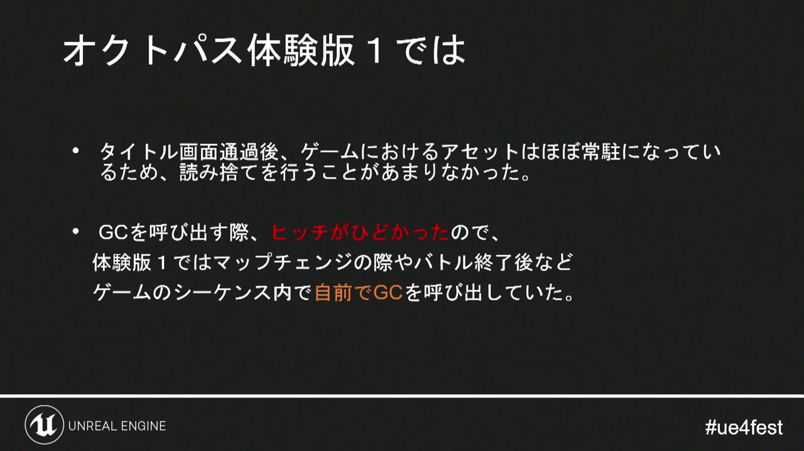
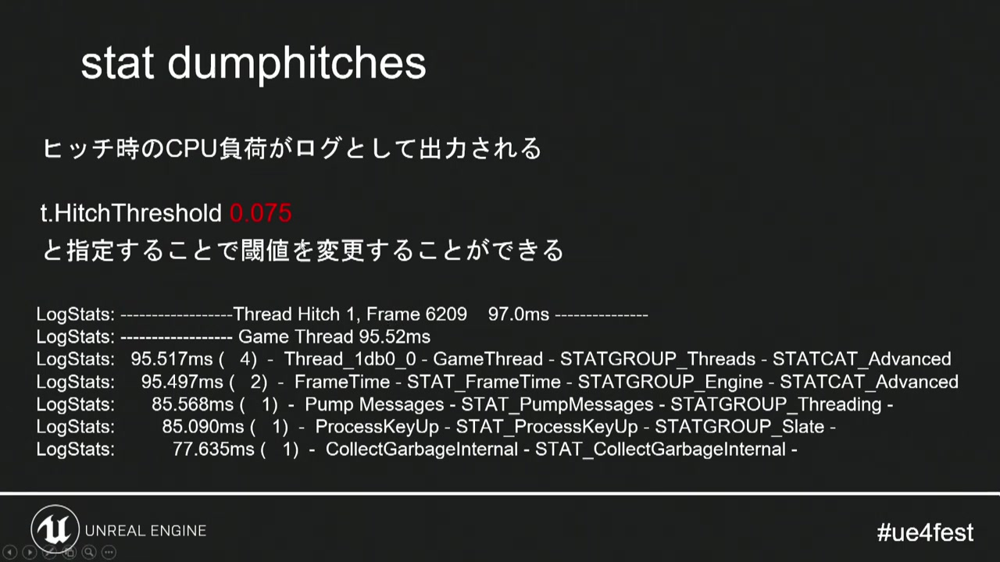
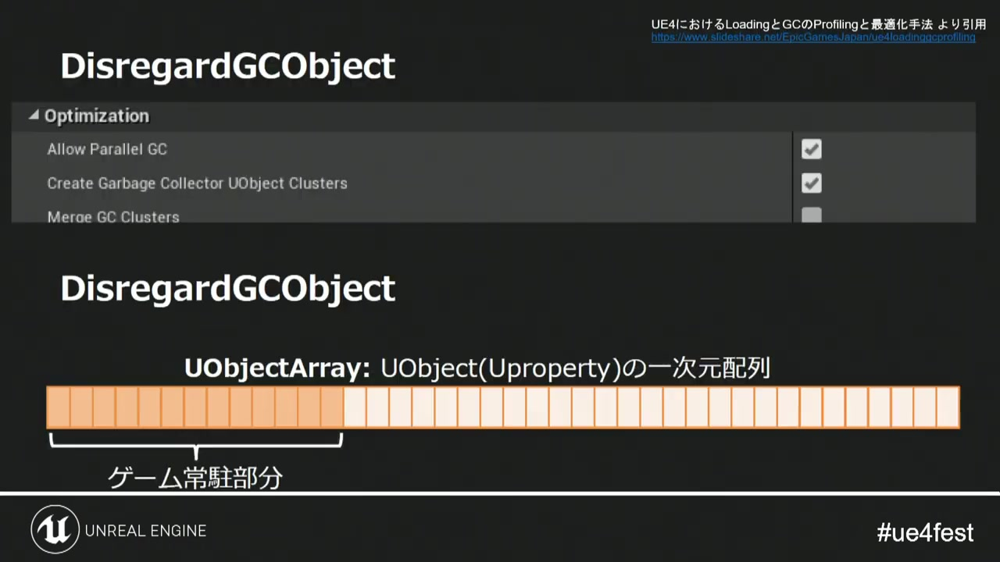
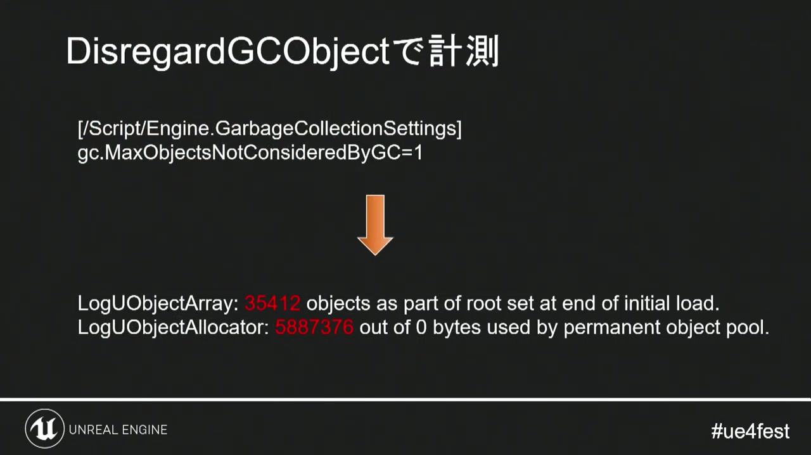
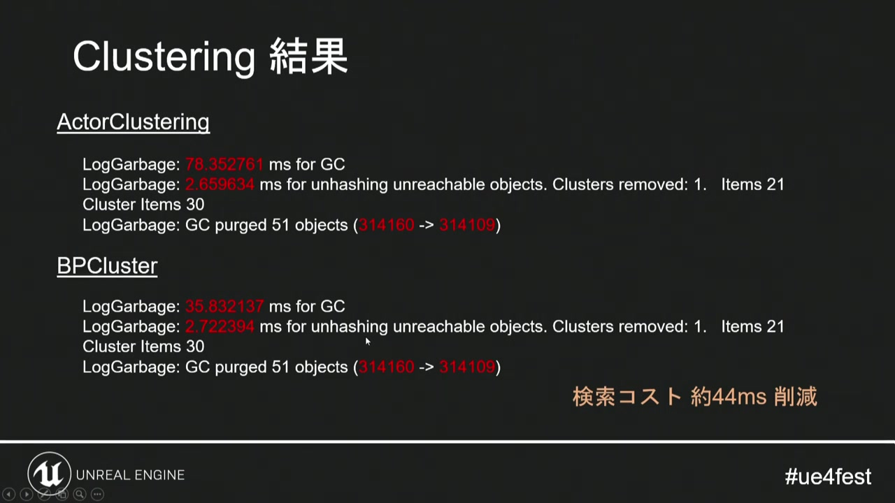
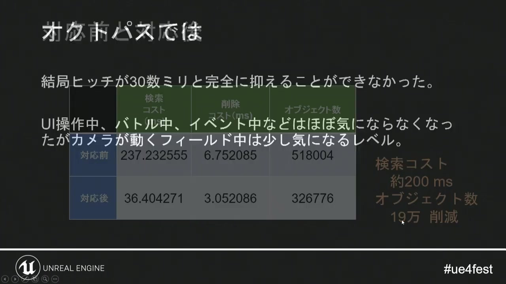
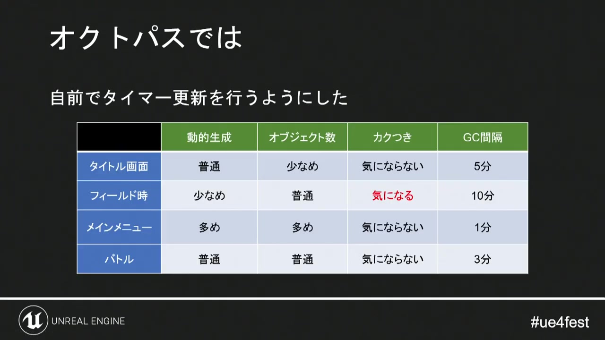
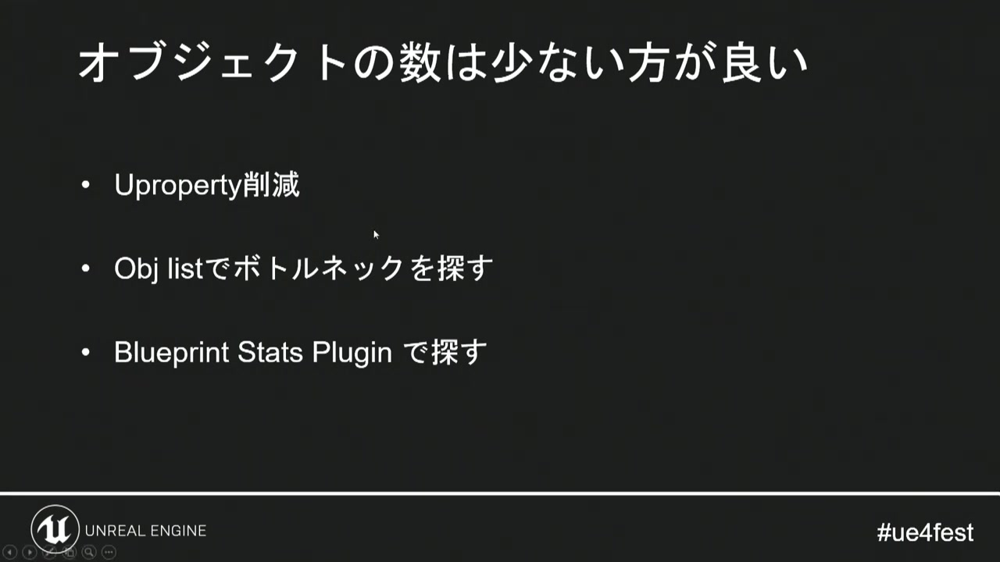

# 09. オブジェクト寿命と性能計測

[前章：スプライトアニメーションのメモリ](08_sprite_memory.md) ｜ [目次へ](../README.md)

**動画範囲:** おおよそ 52:00–63:10

## UE4のGC対策を、そのままGodotへ移植しない

講演後半では、長時間プレイで増えたUMG関連オブジェクト、GC時の検索・削除コスト、`DisregardGCObject`、Actor／Blueprint Clustering、手動GCのタイミングが扱われます。



*図1: ヒッチを避けるため、ゲーム進行上の区切りでGCを呼んでいた。*

GodotのGDScriptは、UE4のUObjectと同じ一括GCモデルではありません。したがって「UE4でGCを30秒ごとに呼んだのでGodotでも同じことをする」という結論にはなりません。移植すべきなのは、**寿命の長いものと短いものを分け、オブジェクト数と解放コストを測り、ユーザー操作へ影響しない区間へ保守処理を置く**という考え方です。

## Godotの寿命モデル

| 種類 | 主な解放方式 | 注意点 |
|---|---|---|
| `Node` | `queue_free()`でフレーム末に解放 | 親を解放すると子も解放。外部参照やSignal接続を確認 |
| `RefCounted` / `Resource` | 参照カウントが0になると自動解放 | 循環参照は自動解放されない |
| 通常の`Object` | 所有規則に従い`free()`等 | 即時`free()`は参照を無効にするため慎重に使う |
| GDScriptのArray／Dictionary | 参照がなくなると解放 | 中にResourceやCallableを保持していないか確認 |
| C#管理オブジェクト | .NET GC | Godot Object側との寿命差、イベント購読に注意 |

通常のNodeは`queue_free()`を使います。即時`free()`は、同じフレーム中に他のコードが参照していると危険です。Resourceは`RefCounted`なので、キャッシュ、配列、Autoload、他Resourceからの参照をすべて外す必要があります。

## 循環参照を作らない

`RefCounted`同士が互いを強参照すると、参照カウントが0にならずリークします。

```gdscript
class_name PartyMemberData
extends RefCounted

var owner_party: WeakRef

func set_party(party: RefCounted) -> void:
    owner_party = weakref(party)

func get_party() -> RefCounted:
    if owner_party == null:
        return null
    return owner_party.get_ref() as RefCounted
```

親子関係や所有関係の片側を`weakref()`にします。Signal接続も参照関係になるため、常駐サービスへ短命NodeのCallableを登録する設計では、Node解放後の接続状態を確認します。

## ヒッチを「検索」と「解放」に分ける


*図2: GCという一語でまとめず、どの工程がフレームを止めるかを特定する。*



*図3: ヒッチが発生したフレームのCPU負荷を記録し、閾値を超えた処理を探す。*

Godotでは、フレーム落ちを次の区間へ分解します。

- Resourceのディスク読み込み
- Sceneのinstantiate
- Nodeの`_ready()`連鎖
- シーンツリーへの大量追加
- 大量の`queue_free()`が反映されるフレーム末
- Physics body／Navigation／RenderingServerへの登録解除
- shaderおよび描画パイプラインの初回準備
- C# GCを使う場合の管理ヒープ停止

一つの手動タイマーだけでは原因が分かりません。Godot Profiler、Visual Profiler、Monitors、独自区間計測を組み合わせます。

## Debugと対象ビルドの両方で測る


*図4: 計測機能を持つビルドと、製品条件に近いビルドの値を比較する。*

Editor実行はデバッグ情報とEditor接続の影響を含みます。一方、Releaseだけでは詳細なProfiler情報を得にくい場合があります。

推奨する計測セット:

1. Editor + Profilerで原因候補を絞る。
2. Debug Exportで対象端末の詳細ログを取る。
3. Release Exportでユーザーが体感する時間を測る。
4. 同じ解像度、同じセーブ、同じ入力列、同じ周回数で比較する。

ピークフレームだけでなく、95／99パーセンタイル、最大フレーム、メモリの戻りを記録します。

## 常駐オブジェクトを選ぶ



*図5: 起動時から終了まで存在するものを、毎回の探索対象から外す考え方。*

UE4の`DisregardGCObject`に直接対応するGodot APIはありません。Godotでの読み替えは、常駐オブジェクトをAutoloadまたはMain SceneのCore branchへ限定し、短命コンテンツへの参照を持たせないことです。

常駐に向くもの:

- Input routing
- 保存と設定
- Audio Busの制御
- シーン遷移の状態機械
- 小さなロード画面Resource

常駐に向かないもの:

- 全キャラクターのSpriteFrames
- 全マップのPackedScene
- 現在の戦闘だけで使うVFX
- 大量のプレビューUI Node
- 場所固有のNPCや音声



*図6: 除外／常駐対象を選び、オブジェクト数と探索コストの差を測る。*

## Clusteringの読み替え



*図7: Actor／Blueprint Clusteringによって検索コストが減少した比較。*

GodotにもUE4のGC Clusteringと同じ仕組みを適用するわけではありません。目的別に次へ読み替えます。

| 目的 | Godotでの手段 |
|---|---|
| Sceneをまとめて解放 | 親Nodeを`queue_free()`し、枝全体を寿命単位にする |
| Resourceをまとめて手放す | 場所／戦闘単位の所有Resourceから参照を外す |
| 描画オブジェクト数を減らす | `MultiMeshInstance3D`、Mesh結合、Server API |
| 大量UIの生成を減らす | 仮想化リスト、表示分だけ生成、限定的な再利用 |
| Physics登録数を減らす | 装飾NodeからCollisionを外し、必要な形状へ統合 |

`MultiMesh`は描画送信を減らす仕組みであり、異なるロジックを持つNodeを自動で軽くするものではありません。一つのMultiMeshは個別カリングされないため、町全体ではなく視界チャンク単位に分けます。

## 手動タイミングを使う場合



*図8: 検索や削除コストを完全には消せず、UI、バトル、イベント中の影響が残った。*



*図9: タイトル、フィールド、メニュー、バトルで更新・GCの間隔を変えた例。*

GodotのGDScriptには通常、UE4型のグローバルGCを定期実行する必要はありません。それでも大きなSceneの解放、キャッシュ整理、ログflush、セーブなど、まとまった保守処理は発生します。

置き場所の優先順位:

1. フェードで画面が覆われたシーン遷移中
2. タイトルへ戻る処理
3. バトル結果からフィールドへ戻るロード区間
4. 入力待ちメニューの直後ではなく、閉じる遷移中
5. プレイヤー操作中は、小さく分割できる処理だけ

C#で`GC.Collect()`を毎一定時間呼ぶ設計は、世代別GCの最適化を崩す可能性があります。割り当て量を減らし、Profilerで停止原因を確認した上で、特定のロード境界だけを候補にします。

## オブジェクト数を予算化する



*図10: UProperty削減、ボトルネック探索、統計ツールの利用というまとめ。*

Godotでは、次の数をシーン別に記録します。

- `Performance.OBJECT_NODE_COUNT`
- `Performance.OBJECT_RESOURCE_COUNT`
- `Performance.OBJECT_ORPHAN_NODE_COUNT`
- `Performance.RENDER_TOTAL_DRAW_CALLS_IN_FRAME`
- `Performance.RENDER_TOTAL_OBJECTS_IN_FRAME`
- 物理Body／Active Object数
- Video RAM合計
- カスタム値: 敵、弾、VFX、UI item、ロード済みVisual Set数

カスタムMonitorの例:

```gdscript
func _ready() -> void:
    Performance.add_custom_monitor(
        "HD2D/LoadedVisualSets",
        _get_loaded_visual_set_count
    )

func _get_loaded_visual_set_count() -> int:
    return VisualSetRegistry.loaded_count()

func _exit_tree() -> void:
    Performance.remove_custom_monitor("HD2D/LoadedVisualSets")
```

独自の意味を持つ数を標準Monitorと同じ時間軸で表示すると、「Objectが増えた」から「戦闘終了後もVisual Setが8件残った」へ調査を具体化できます。

## 回帰試験シナリオ

次の操作列を自動化または手順書化します。

```text
起動
→ タイトル表示
→ セーブ読込
→ 町を60秒移動
→ メニューを10回開閉
→ 戦闘を10回繰り返す
→ 別マップへ移動
→ タイトルへ戻る
```

各チェックポイントで、フレーム時間、Node数、Resource数、VRAM、ObjectDBスナップショットを保存します。10周目の値が1周目へ戻らないなら、常駐が仕様なのか参照残りなのかを分類します。

## 最終チェックリスト

- [ ] `queue_free()`する所有者がScene branchごとに明確
- [ ] RefCountedの循環参照を`WeakRef`または所有方向の変更で防いでいる
- [ ] Editor、Debug Export、Release Exportを同条件で比較している
- [ ] CPU ProfilerとVisual Profilerを混同していない
- [ ] ObjectDB Profilerの前後スナップショットを保存している
- [ ] MultiMesh化の前後でdraw callとカリングを測っている
- [ ] プールが未使用Resourceを保持してメモリを増やしていない
- [ ] 最適化の結果が画面品質や操作応答を悪化させていない

## 公式資料

- [RefCounted](https://docs.godotengine.org/en/latest/classes/class_refcounted.html)
- [WeakRef](https://docs.godotengine.org/en/latest/classes/class_weakref.html)
- [Debugger panel](https://docs.godotengine.org/en/stable/tutorials/scripting/debug/debugger_panel.html)
- [Performance](https://docs.godotengine.org/en/stable/classes/class_performance.html)
- [Using the ObjectDB profiler](https://docs.godotengine.org/en/latest/tutorials/scripting/debug/objectdb_profiler.html)
- [CPU optimization](https://docs.godotengine.org/en/latest/tutorials/performance/cpu_optimization.html)
- [MultiMesh](https://docs.godotengine.org/en/latest/classes/class_multimesh.html)

---

[前のページ：08. スプライトアニメーションのメモリ](08_sprite_memory.md) ｜ **読了：[目次へ戻る](../README.md)**
